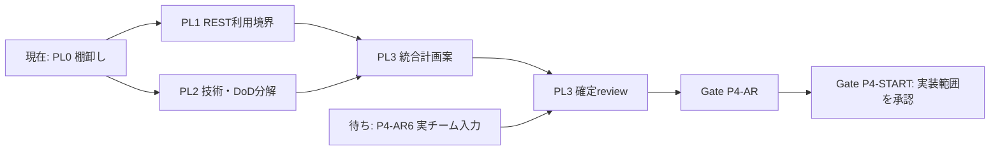
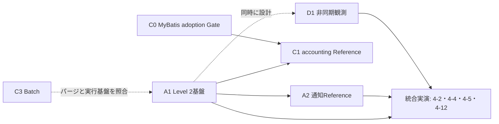

# KOIKI-JavaWeb-FW Phase 4 実施計画 見直し草案 v0.1

**状態:** DRAFT / R1〜R7 OWNER REVIEW COMPLETE（計画詳細はP4-PL1 / PL2で継続）。Phase 4開始・実装・配布は未承認  
**作成日:** 2026年9月26日  
**作業branch:** `docs/phase4-execution-plan-review`  
**起点:** `main` / `f7ad141`（`v0.1.0-pre-phase4-readme-docs`）  
**対象:** Phase 4 Enterprise IntegrationのFramework側再計画。Customer主導のP4-03Bは連携・gap判断の入力として追跡し、Customer成果物の実装計画は本書で確定しない。

## 1. 見直しの理由と現在地

グランドデザイン§27.8のPhase 4は、Framework、Reference、実案件で実証する成果物を一つのPhaseに含む。
P4-AR1〜AR5とFramework側のP4-AR6準備は完了したが、P4-AR6実チーム受入、AR-D10の責任分担判断、
P4-AR7の実チーム由来finding、Gate P4-AR、Phase 4開始判断は未完了である。
実案件側の確認待ちを理由に、Framework側で可能な棚卸し、契約候補の設計、検証計画まで停止する必要はない。
一方、この草案はP4-ARの完了条件を変更せず、Phase 4 production実装の承認を代替しない。

本見直しでは、当初の成果物とDoDを維持した状態を起点に、実装Owner、Evidence Owner、依存条件、順序を
再判定する。DoDを移管・延期・変更する場合は、Architecture Ownerが理由と代替Evidenceを明示し、
グランドデザインおよび該当ADRとの整合を別途承認する。

### 1.1 実案件から得た入力の確度

| 区分 | 現時点の入力 | 計画での扱い |
|---|---|---|
| 確定した方向性 | frontendはNext.js/BFFを実案件側が主導し、KOIKIとの連携はRESTで行う | P4-03BをCustomer主導の接続trackとして追跡する。KOIKI側は既存REST契約の利用可能性を確認する |
| 見込み | 外部IdPによるSSO | 認証方式の候補として保持する。Provider、protocol、token、KOIKIとの信頼境界は未決定 |
| 未取得 | 業務機能、非機能、frontend / backend配置、API利用範囲、IdP、artifact配布方式、受入体制と日程 | Phase 4のFramework成果物へ要件を推定して追加しない。P4-AR6または個別の設計入力で確認する |

REST連携という情報からBearer JWT、KOIKI Session共有、特定IdP、SAML、CognitoまたはALB採用を確定しない。
認証・認可を含む実際のrequest topologyは、実案件チームの設計結果を受けて判定する。

## 2. 判断に用いる入力と境界

- [グランドデザイン§27.8](../architecture/grand-design/KOIKI-JavaWeb-FW_グランドデザイン_v0.2.md)の成果物・DoD 4-1〜4-12を当初baselineとする。
- [P4-AR計画§8](KOIKI-JavaWeb-FW_Pre-Phase4_Adoption_Readiness計画_v0.1.md)の責任分担候補と、[P4-AR6契約](../architecture/validation/pre-phase4-p4-ar6-actual-project-handoff-contract.md)の未決定事項を引き継ぐ。
- 実案件のNext.js/BFFとREST連携を確定入力とする。外部IdP SSOは見込みであり、[UI / Authentication Profile Selection Guide](frontend-authentication-profile-guide.md)のProfile Bは認証方式を決める際の候補として参照する。
- P4-AR2〜AR5のEvidenceはFramework側で再現したbaselineである。実チーム受入結果や実案件要件を推定しない。
- Spring標準を優先し、Framework、Reference、Customer、ToolingのOwnershipを分ける。Referenceの業務実装、Consumer、fixture、ToolingをFramework Public APIへ自動昇格させない。
- Phase 2 Security、Phase 3 Reference、required checksの承認済み契約を維持する。Project TemplateはPhase 5に置く。
- remote push / PR / merge、workflow・ruleset変更、snapshot publish、実Customer Repository操作は個別承認事項である。

## 3. 当初Phase 4案件の棚卸し

「Framework先行」は、現時点では既存契約の調査、設計案、非配布fixtureの検証計画までを指す。
production code、Public API、migration、dependency、Starterまたはworkflowの変更は、対象work packageの
blocking reviewと開始判断後に行う。「共同Evidence」は実案件での成功だけでKOIKI側DoDを満たす意味ではない。

| ID | 当初成果物 / DoD | 暫定OwnerとFramework側で先行できること | 実装・受入の依存条件 |
|---|---|---|---|
| P4-01 | `notification`、Level 2、耐久配信、冪等性、失敗観測、再送、パージ、相関ID / 4-1〜4-5・4-12 | Framework: Spring Modulith採用範囲、event・publication・運用契約の設計と非配布検証計画。Reference: Tier 1 / JPAの通知log、`ExpenseApproved` / `ExpenseRejected`受信、外部I/Oと冪等性の実証。 | transaction / retry / idempotency / retention、Level 2 runtime依存とmigrationのblocking review。実案件の通知内容・provider・運用はCustomer Ownershipとし、共同Evidenceの再現条件を決定。 |
| P4-02 | `accounting`、MyBatis分離、楽観lockと共通error / 4-6 | Architecture / Framework: adoption triggerの判定基準、延期したRule 25〜27 / 30〜37とfixture案の再review準備。Reference: Tier 2の模擬既存schema、`ExpenseSettled`受信、仕訳生成・外部連携を実証する候補。 | 明示triggerまたは`accounting`開始判断。`PersistenceModel.SEPARATED`、MyBatis依存・fixture・規約を事前承認。trigger前はRule 8拒否を維持。実案件のschema / SQL / 会計連携はCustomer Ownership。 |
| P4-03S | `expense` SPA最小参照実装とMVC / SPA併用、KOIKI Session / CSRF / CORS / 4-8・4-9 | Framework: Session APIと既存Security chainの契約確認。Reference: same-origin Session SPAとMVC併用の実証候補。 | 当初DoDはSession SPAであり、実案件BFFのREST経路だけでは充足しない。Referenceで維持するか、DoDを変更するかをOwnerが明示判断。 |
| P4-03B | 実案件Next.js/BFF + KOIKI RESTのCustomer主導integration track | Customer: topology、Next.js/BFF、KOIKI側の案件設定、REST結合の設計・実装・検証を主導。Framework: 既存API / Security / Identity / Permission / Audit契約の説明、再現可能なgapの審査。 | API path / DTO / error / version、認証profile、権限、logout等は実案件設計で具体化する。Reference実装やtest issuerを正式契約として流用しない。KOIKI側で受け入れるEvidenceと変更要求はP4-AR6の責任分担へ入力する。 |
| P4-04 | SAML Extensionと外部IdP SSOの関係 | Architecture / Framework: OIDC優先との適合、Adapter境界、threatと運用Ownerの論点整理。 | 外部IdPがOIDCを提供するか、SAMLを上流brokerがOIDCへ変換するか、KOIKI / BFFがSAMLを直接処理する要件かを確認。前二者なら直接SAML Extensionの必要性を再判定し、当初成果物からの変更はOwner決定を記録。 |
| P4-05 | External API Resilience / 4-7 | Framework: 既存timeout、`@Retryable`、`@ConcurrencyLimit`契約とResilience4j採用基準の評価計画。 | 接続先、失敗semantics、冪等性、SLA、秘密情報のOwner。Circuit Breakerの追加は第三者library review後。Customer固有AdapterはCustomerに置く。 |
| P4-06 | Spring Batch / 4-10 | Framework: 単一実行・二重起動防止・再実行・診断の共通境界を評価。Reference: 未処理申請リマインドと月次締めの実証候補。Tooling: 起動・重複実行の検証。 | job起動基盤、metadata schema、運用Owner。実案件jobはCustomer Ownership。Framework汎用Batch Public APIを先行確定しない。 |
| P4-07 | File / Object Storage | Framework: Spring標準と既存Port / Adapterでの実現可能性、Security / Audit / cleanup観点を整理。 | 実format、保存先、retention、access policyはCustomer入力。AWS固有Adapterは個別reviewまで作らない。 |
| P4-08 | OpenTelemetry、非同期trace / 4-4・4-12の観測面 | Framework: Phase 1b Observability baselineからmetric / trace / correlationの不足を列挙。 | exporter、監視基盤、retention、alertは運用Ownerと合意。Level 2の採用と整合させて検証。 |
| P4-09 | Container・ECS Reference | Reference / Tooling: package済みReferenceのcontainer化、起動・停止・migration・health・logの検証計画。Framework: runtime要件。 | platform、network、secret、resourceとdeploy Owner。ECS参照はCustomer固有環境の受入代替にしない。AWS固有AdapterをFrameworkへ追加しない。 |
| P4-10 | Virtual Threads有効化ガイドとCI系統 / 4-11 | Framework / Tooling: Java 21 build / Java 25 opt-in runtime baseline、pinning、Session / JDBC / tracingの検証範囲とCI費用を見積る。 | 有効化条件、失敗時診断、required check変更のblocking reviewと個別承認。既定で無効のbaselineを維持。 |
| P4-11 | 正式な受渡し対象、配布repository、version / support条件 | Framework release / Architecture: P4-AR inventoryとR2 stageの限界を整理し、release Gate案を作成。 | P4-AR6の実チーム受入、platform / release Owner、正式配布・support判断。内部snapshotまたはR2 stageを正式releaseと呼ばない。 |
| P4-OPT | KOIKI-hosted Authorization Server、Oracle | 対応するoptional Gateの判断材料のみ整理。 | `P4-AS0`または`P4-ORACLE`の明示triggerと個別承認。Phase 4必須DoDへ自動追加しない。 |

### 3.1 Next.js/BFFとRESTの結合境界

実案件チームがP4-03Bの設計・実装・検証を主導する。以下はFrameworkとの接続時に共有する
境界と確認項目であり、Framework側がNext.js/BFFや外部IdP統合を実装する計画ではない。
確定している結合は`Next.js/BFF -> KOIKI REST`である。画面とBFFの実装、認証client、
KOIKIへのcredentialの渡し方は実案件側が決める。KOIKIのApplication Use Case、Permission、DB、
Business Auditをfrontendへ移さず、各REST requestで認証・認可を完結させる。

外部IdP / SSOを採用する場合の有力候補はProfile Bである。この場合はBrowserからBFFへSession Cookie、
BFFからKOIKIへAPI向けBearer Access Tokenを使い、BFFがOAuth confidential clientを所有する。
これは未確定の条件付き構成であり、現時点の採用決定または実案件の受入結果ではない。
KOIKIはBFFを特権的に信頼せず、各API requestのcredentialと業務権限を検証する。

```text
確定: Browser --> Next.js/BFF -- REST --> KOIKI API --> Use Case / DB / Audit
候補: Browser -- BFF Session --> Next.js/BFF -- Access Token --> KOIKI Resource Server
                                    |
                                    +-- OIDC Authorization Code --> 外部IdP
```

| 確認点 | 統一する契約と検証事項 | 主なOwner |
|---|---|---|
| REST contract | KOIKIが提供済みのAPI path、version、DTO、Problem Details、401 / 403 / 409、pagination、correlation IDと、実案件が必要とするAPI範囲との差を確認する。業務APIの追加はCustomer Ownershipから判断する。 | Customerが利用範囲を示す。Frameworkは公開済み契約とgapを説明 |
| 認証profile | BFFからRESTへ渡すcredential、BrowserからKOIKIへ直接通信するか、KOIKIのSession / Bearer routeをどう分けるかを実案件が選ぶ。REST採用だけでBearerや外部IdPを固定しない。 | Customerが選択。FrameworkはSecurity境界を審査 |
| 外部IdP / token（採用時） | issuer、JWTまたはopaque token、KOIKI API向けaudience / resource、scope、実claim、JWKS / key rotationを確認する。IdPがAPI向けAccess Tokenを発行できなければbroker / token exchange / 別profileの設計判断へ戻す。ID TokenはKOIKI APIへ送らない。 | Customer / IdP。Frameworkは契約gapを審査 |
| Subject / permission（外部IdP採用時） | `issuer + subject`からFramework userへのlink、無効user、権限変更の鮮度、業務scopeとPermissionの突合を決める。Reference固有の`koiki_user_id` claimを外部IdPが発行すると仮定しない。 | Customerがmappingを設計。Frameworkは公開契約を審査 |
| Browser / BFF | 選択した認証方式に応じてBFF Session、CSRF、timeout、logoutと複数instanceでの状態管理を決める。外部IdP採用時はOAuth `state` / `nonce` / PKCE、redirect、token refreshを確認する。Route Handler / Server Actionは個別にsessionと権限を確認する。 | Customer frontend。IdP関連は採用時に追加 |
| BFF / KOIKI API | BFFの転送先・method・headerを許可リスト化する。Bearer方式を選ぶ場合は利用者ごとのAPI向けAccess Tokenを渡し、Cookie、ID Token、client secret、任意の転送先または内部headerをKOIKIへ流さない。APIは401 / 403 / 409、Problem Details、validation errorをBFFが意味を保って処理できるか確認する。 | Customerが結合実装。FrameworkはAPI契約を審査 |
| Data / observability | SSR / Server Component / Route Handlerの利用者別dataを別userへcache・配信しない。tokenやPIIをHTML、Client Component props、logへ露出しない。BFFとKOIKIのcorrelation ID、Security / Business Auditの責任分担を追跡する。 | CustomerがE2Eを検証。FrameworkはKOIKI側観測契約を審査 |
| Route / operations | BFFへの公開routeとKOIKI APIへの直接到達可否、origin、reverse proxy、secret / network / health / deploymentを明示する。BFFからKOIKIへのserver-to-server通信自体にbrowser CORSは要らない。browserからKOIKI APIへの直接通信を採用するなら別profileとしてCORSを審査する。BFF経由でもKOIKIのdefault denyを維持する。 | Customer platform。FrameworkはSecurity境界を審査 |

現行の`koiki-starter-security`は未一致requestをdenyするfallbackを提供する。Phase 3 Referenceの
`/api/**` Bearer `SecurityFilterChain`、`JwtDecoder`のaudience / `token_use`検証、`koiki_user_id`変換は
Reference所有の実装であり、外部IdPとNext.jsのproduction結合Evidenceではない。
外部IdPを用いるProfile Bが選ばれた場合、Customer側のSpring Security構成で安全な契約を組めるか、
Framework側に不足する公開契約があるかを、実案件側の設計・検証結果から切り分ける必要がある。
Frameworkへ戻すgapには使用artifact、最小再現、期待する公開契約、既存Spring標準での実現可否、
Security / Audit / migrationへの影響、Customer内に隔離できるかを非機密情報で示す。
Customer固有のBFF、IdP設定、画面、schema、deploymentはCustomerに置く。共通化候補は
Grand Design§9.2とArchitecture reviewで再利用性・契約安定性・support責任を判断し、
ReferenceやCustomerのcodeをFrameworkへ直接昇格させない。

KOIKIのMVC管理画面も実案件で併用する場合、BrowserはBFF SessionとKOIKI Sessionを別々に持つ。
同じIdPによるSSOを後に選んでも、両Sessionの有効期限、logout、権限変更時の失効を自動的に同一視しない。
MVC routeとBearer API routeのSecurityFilterChain、Cookie、CSRF、401 / 403応答を分けて検証する。

Customer側のP4-03B検証では、RESTの通常操作、認証拒否、権限不足、validation、409競合、
複数user、Audit / trace / cleanupを確認する。外部IdP SSOを採用した場合はlogin / callback、
誤issuer・audience・scope・ID Token、token期限切れとrefresh失敗、CSRF欠落、logout後の
BFF Sessionと既発行Access Tokenの残存window、複数instanceも追加する。
P4-AR6でCustomer側の実施Owner・非機密Evidence・Framework側の受入範囲と時期を決める。
Framework側は既存Consumer / Referenceで契約を照合できるが、その結果をCustomer側E2Eの代替にしない。

設計根拠: [RFC 10017 BFF pattern](https://www.rfc-editor.org/rfc/rfc10017.html#section-6.1)、
[Next.js Authentication](https://nextjs.org/docs/app/guides/authentication)、
[Next.js Backend for Frontend](https://nextjs.org/docs/app/guides/backend-for-frontend)、
[Next.js Data Security](https://nextjs.org/docs/app/guides/data-security)、
[Spring Security Resource Server](https://docs.spring.io/spring-security/reference/servlet/oauth2/resource-server/jwt.html)。

## 4. Framework側の再開順序案

| 段階 | 成果物 | 開始条件 / 停止点 |
|---|---|---|
| P4-PL0 計画baseline（現在） | §1.1の入力確度、§3の全件棚卸しとDoD対応、Ownership仮説を固定する | 文書とread-only調査に限定。P4-AR6 / Gate P4-ARの状態を変更しない |
| P4-PL1 REST利用境界 | 現行formal artifact、Reference REST / Bearer実装、Customer-like Consumer、Security fallbackとDeveloper Journeyから、Customerが通常のSpring構成で使える契約、Reference専用部分、未検証部分を一覧にする | 実案件APIや認証方式を仮定しない。既存source / Evidenceの確認と、必要なら別途承認された非配布検証まで |
| P4-PL2 技術・DoD分解 | P4-01〜11とoptional項目の設計論点、前提、blocking review、検証環境、DoDの実演単位と概算を作る。P4-03S / 03B、外部IdP SSO見込み / SAML当初成果物を区別する | Public API、module、dependency、migration、workflowやproduction codeを先行変更しない |
| P4-PL3 統合計画review | 実装Owner、Evidence Owner、依存関係、工数、成果物の採否、DoD変更案、release経路をOwnerが判定できる形にする | P4-AR6実チーム受入から得られた事項を確定情報として反映する。それ以前は未取得として保持する |
| Gate P4-START | Gate P4-ARの結果と改訂Phase 4計画から、production実装の範囲、順序、予算、検証、Remote Gateを承認する | 現行P4-AR計画ではGate P4-ARとPhase 4開始判断が必要。Framework限定の先行開始は§4.3のP4-F案を別途改訂・承認した場合だけ |

P4-PL1とPL2は並行できる。P4-03BはCustomer側trackのためFrameworkのcritical pathへ置かず、
REST契約のgapとP4-AR6入力だけを同期する。P4-01のLevel 2とP4-08の非同期観測、
P4-06のBatchとP4-01のパージ実行基盤は同じ契約検討で重複を避ける。
P4-04、P4-07、P4-09は実案件・運用環境の入力がない部分を未決定として残す。

### 4.1 Gate後の実行work package候補

次は実装承認ではなく、見積と依存関係を確認するための構成案である。

| Package | 中心成果物 / 実演DoD | 前提と依存 | Owner候補 |
|---|---|---|---|
| P4-A1 Level 2基盤 | publication永続化、失敗状態、再送・パージ・相関の技術契約。4-2・4-4・4-5・4-12の前提を用意 | Spring Modulith Level 2、transaction、migration、runtime依存、運用・観測のblocking review。DoDのPASSはA2 / D1との統合実演で判定 | Framework契約 + Tooling検証 |
| P4-A2 通知Reference | 非同期メール、承認非rollback、冪等送信 / 4-1・4-3。A1 / D1と組み合わせて4-2・4-4・4-5・4-12を実演 | P4-A1。業務event、providerと通知logはReference所有 | Reference実装 + Framework契約検証 |
| P4-B1 SPA / MVC Reference | `expense` RESTを使うReact最小参照、KOIKI SessionのSPA API、CSRF double-submit、Thymeleaf併用 / 4-8・4-9 | 当初DoD維持・変更のOwner判断。Security routeとfrontend実証方法のreview | Reference + Framework Security契約 |
| P4-B2 Customer REST接続 | Next.js/BFFからKOIKI RESTへの利用、gapと非機密Evidence | Customer側のAPI利用範囲・認証方式・環境。P4-B1の代替DoDにはしない | Customer主導。Frameworkは契約gap審査 |
| P4-C0 MyBatis adoption Gate | trigger判定、分離モデル・規約・fixture・Public API影響の判断 | `accounting`着手前。trigger不成立ならRule 8拒否を維持 | Architecture / Framework |
| P4-C1 accounting Reference | MyBatis分離、楽観lock、共通error / 4-6 | P4-C0とP4-A1。外部会計連携を模擬するReference境界 | Reference + Framework規約検証 |
| P4-C2 外部API耐障害性 | timeout / retry / concurrencyと障害時の応答 / 4-7 | 接続先と失敗semanticsをReferenceまたはCustomerで明示。Resilience4j採用は個別review | Framework契約 + Reference実証 |
| P4-C3 Batch | 単一実行、二重起動拒否、再実行 / 4-10 | Reference jobと運用Owner。P4-A1のpublicationパージと共通の実行基盤を利用するかを判断 | Framework境界 + Reference実証 |
| P4-C4 File / Object Storage | Port / Adapter、Security / Audit、保存・失敗・cleanupの実証 | Referenceで代表use caseを選ぶ。実案件固有format、bucket、権限はCustomer所有 | Reference実証 + Framework境界review |
| P4-D1 観測 | OpenTelemetryとLevel 2のtrace / metric / log相関 / 4-4・4-12 | P4-A1と同時設計。exporter / retentionは運用Ownerと判断 | Framework + Tooling |
| P4-D2 Virtual Threads | 有効化ガイド、Java 25 opt-in runtime、CI系統 / 4-11 | CI変更の個別承認。既定無効、pinningとruntime互換の確認 | Framework + Tooling |
| P4-D3 Container / ECS | package済みReferenceのcontainer / ECS起動・診断 | deployment、secret、network、resourceとplatform Ownerを明示。AWS固有AdapterをFrameworkへ追加しない | Reference + Tooling + platform |
| P4-E1 受渡し・release経路 | 受渡し対象、Maven repository候補、version / checksum、supportと診断入口を判断する。publish / 正式release実行は別Gate | P4-AR6実チーム受入とrelease / platform Owner判断。R2 isolated stageを正式releaseへ読み替えず、Phase 5 Production Baselineも先行しない | Framework release + Architecture |
| P4-X 条件付き判断 | SAML Extension、P4-AS、P4-ORACLE | SAMLは当初成果物として採否を明示。P4-AS / ORACLEは個別optional Gate | Architecture Owner |

P4-A1はA2とC1の共通前提であり、先行候補とする。P4-D1はA1と同時に設計し、
P4-C3の実行基盤もA1のパージと照合する。P4-B1、P4-C2、P4-C4、P4-D2のうち
依存しない検証は並行できる。各packageのcommit point、対象module、検証コマンド、
Evidenceと所要工数はP4-PL2で具体化する。DoDの変更やP4-Xの不採用は計画草案だけで確定しない。

#### 4.1.1 順序・待ち条件の見取り図（R5判断用）

計画と実装を別に示す。実線は次へ進むための入力、点線は別途判断が必要な関係を表す。



PL1とPL2は並行して進められる。P4-AR6の入力を得る前にもPL3の案は作れるが、
実チームの責任分担・受渡しを確定した計画とはしない。現行Gateに従うproduction開始は、
Gate P4-ARと別のGate P4-STARTを待つ。§4.3のP4-Fはこの順序を変える**未承認の別案**で、R6にて案の作成可否だけを判断する。



| 区分 | 実施順・並行性 | 何を待つか |
|---|---|---|
| 現在進める設計 | PL1とPL2を並行。PL3案も作成可能 | production変更はしない。PL3確定にはP4-AR6の実チーム入力が必要 |
| Gate後の共通前提 | A1を先に設計・実装。D1の観測契約はA1と同時に設計 | A1のmigration・dependency・Public API等のblocking reviewと開始承認 |
| A1に依存する実証 | A2はA1の後。C1はA1とC0の両方の後 | A2の通知契約、C1のMyBatis adoption判断をそれぞれ別に承認 |
| 統合DoD | A1・A2・D1を合わせて4-2・4-4・4-5・4-12を実演 | A1単体をこれらのDoDのPASSとしない |
| 並行候補 | B1、C2、C4、D2等の独立した設計。C3はA1のパージと実行基盤を照合 | 各package固有の入力とGate。C3をA1の必須前提とは決めない |
| 実案件・受渡し | B2はCustomer主導で進め方を調整。E1はP4-AR6入力後に判断 | B2の案件API・認証設計、E1の実チーム受入とrelease Owner判断 |

### 4.2 P4-PL1の既存契約確認（開始時点）

| 領域 | Repositoryで確認できる現行境界 | P4-PL1で残す確認 |
|---|---|---|
| API Starter | `koiki-starter-api`はSpring MVC / Validation、path API versioning、Problem Detailsの既定を提供する。業務固有のREST endpoint / DTOはCustomerまたはReferenceのOwnership | 実案件が必要とするAPIの範囲、error / version / pagination等の契約差分。Frameworkの独自Java Public API追加を前提にしない |
| Security Starter | `koiki-starter-security`はdefault deny fallbackとSpring標準OAuth2 Client / Resource Server依存を提供する。Customerがroute別chain、issuer / audience / scope、CORSを構成する | Next.js/BFFからRESTを呼ぶ認証方式とCustomer側chainの設計。SSO / Bearerはまだ確定しない |
| Reference REST | `koiki-reference-app`のBearer `/api/**` chain、JWT claim変換、expense REST、API errorはReference所有でpackage JARのjourneyがPASS | Frameworkの正式契約で利用できる点と、Referenceの例として読むだけの実装を分離する |
| isolated Consumer | P4-AR3で現行formal release unitの隔離stageとSecurity Consumerのpackage / PostgreSQL integrationがPASS | Next.js/BFFとの実結合を証明する結果ではない。Customer側E2EとFramework gap報告の受入条件をP4-AR6で決める |

参照: [API Starter](../../koiki-starters/koiki-starter-api/README.md)、
[Security Starter](../../koiki-starters/koiki-starter-security/README.md)、
[P4-AR3 Evidence](../architecture/validation/pre-phase4-p4-ar3-runtime-security-consumer-baseline.md)、
[P4-AR4 Evidence](../architecture/validation/pre-phase4-p4-ar4-reference-application-baseline.md)。

| 計画段階 | 現時点の進捗 | 次に必要な成果物 |
|---|---|---|
| P4-PL0 | §1.1と§3の棚卸し草案を作成 | Owner reviewで入力確度と当初DoDの扱いを確認 |
| P4-PL1 | 上表のsource / Evidence照合と[REST利用境界差分台帳 v0.1](KOIKI-JavaWeb-FW_Phase4_PL1_REST利用境界差分台帳_v0.1.md)を作成 | 実チームのAPI / 認証 / Audit入力はP4-AR6で取得。未取得事項はOPENを維持 |
| P4-PL2 | §4.1のwork packageと主要依存を仮置き。[P4-F提案](KOIKI-JavaWeb-FW_Phase4_P4-F限定開始Gate提案_v0.1.md)、[非配布検証](../architecture/validation/phase4-pl2-level2-verification.md)、[P4-F判定資料 v0.1](KOIKI-JavaWeb-FW_Phase4_PL2_P4-F判定資料_v0.1.md)にA1 / A2 / D1の候補・実演差分・既存見積仮配賦を記録 | store・migration・運用Ownerの選定、未検証事項、Phase共通とAI支援Owner稼働の再見積、P4-01〜11全件のPL2台帳 |
| P4-PL3 | 未開始 | P4-AR6の実チーム入力を加えた責任分担・工数・Gate提案 |

### 4.3 P4-AR6を待たないFramework限定開始Gate案

現行のP4-AR計画はGate P4-ARと別のPhase 4開始判断を要求している。
実案件情報が§1.1の範囲に留まる間もproduction作業を再開するなら、次の`Gate P4-F`を
P4-AR計画とAgent guidanceに明示的に追加し、Architecture Ownerが限定範囲を承認する案を推奨する。
これは本草案の作成や現在のユーザー方針から自動成立しない。
R6で作成を承認された[Gate P4-F提案 v0.1](KOIKI-JavaWeb-FW_Phase4_P4-F限定開始Gate提案_v0.1.md)に、
現行Gateとの差分、提出Evidenceおよび停止条件を記載した。PL2で工数・module配置・検証を具体化する。

| 判断項目 | P4-F案 |
|---|---|
| 開始対象 | Framework共通のP4-A1 Level 2基盤、Referenceで契約を実証するP4-A2通知、P4-D1非同期観測。P4-PL1 / PL2の計画作業も継続 |
| 開始前Evidence | Phase 3 accepted baseline、P4-AR1〜AR5とFramework側P4-AR6準備の結果、clean source identity、対象packageの設計・工数・blocking review、独立した検証計画 |
| 保留する対象 | P4-B2実案件BFF、実案件IdP / SSO、正式artifact受渡し、P4-E1、Customer-specific integration。P4-AR6、AR-D10とGate P4-ARは完了扱いにしない |
| 個別停止点 | Public API、dependency、migration、Starter、workflow、Security既定、Remote Gateは各packageのblocking reviewと個別承認に従う。P4-C0を通る前にMyBatisを追加しない |
| Phase 4全体の完了 | 当初DoD 4-1〜4-12の実演、採否変更のOwner記録、P4-AR6 / Gate P4-ARの責任分担と受渡し判断を別途必要とする |

P4-Fを採用しない場合は現行Gateの順序を維持し、P4-PL0〜PL2の計画・read-only調査を進める。
採用する場合もPhase 3を再オープンせず、Customerの開発開始承認や実案件の受入PASSへ読み替えない。

## 5. 次のOwner判断に必要な事項

| ID | 判断事項 | 現時点の推奨案 |
|---|---|---|
| D1 | P4-AR6の実チーム確認待ちとFramework側作業をどう並行させるか | P4-PL0〜PL2のread-only計画作業を進め、実装候補は範囲・Evidence・費用を示して個別判断する。P4-AR6 / Gate P4-ARを完了扱いしない。 |
| D2 | 当初DoD 4-1〜4-12を維持するか、Owner / Evidenceを再配分するか | まず全件維持で計画し、移管・延期・変更が必要な項目のみ理由と代替Evidenceを個別提案する。 |
| D3 | `notification` / Level 2、Virtual Threads、Resilience評価をFramework先行候補にするか | 既存契約と必要Evidenceの調査から着手する。production変更はwork package別review後。 |
| D4 | MyBatis、SPA、SAML、storage、ECS参照のtriggerとOwnerをどう置くか | 当初成果物は残した上で、各packageの必要入力と採否GateをP4-PL2で整理する。実案件要件を推定せず、未確定なら計画上の保留を可視化する。 |
| D5 | Phase 4開始をP4-AR Gateより先にFramework範囲へ限定して許可するか | 今回は§4.3のP4-Fを設計候補として扱う方向をreviewする。開始承認はP4-PL2の設計・工数・検証を揃えた別Gateで判断する。採用時はP4-AR計画・Agent guidanceのGate関係を改訂する。 |
| D6 | 実案件のNext.js/BFF + REST連携をPhase 4計画でどう扱うか | P4-03BはCustomer主導の設計・実装・E2E検証とし、Framework側は契約説明、gap審査、共通化判断を担当する。外部IdP SSOは見込みとして別に判断する。P4-03Sの当初DoD 4-8 / 4-9とは分けて追跡し、KOIKI側で受け入れるEvidenceと責任分担をP4-AR6で決める。 |
| D7 | 受渡し範囲をPhase 4でどう決めるか | P4-E1でP4-AR inventoryと実チーム受入を入力に対象・repository候補・version・supportを決める。R2 stage、publish / 正式releaseとPhase 5 Production Baselineを別判断にする。 |

## 6. この草案の完了条件

1. §3の各項目をグランドデザイン§27.8の成果物とDoD 4-1〜4-12へ追跡できる。
2. P4-AR6由来の未決定事項、実案件由来の未取得情報、Framework側で独立に検証できる事項を区別できる。
3. 各work packageの実装Owner、Evidence Owner、blocking review、概算と順序をOwnerが判定できる。
4. Phase 4開始、正式受渡し、Public API / dependency / migration / workflow変更の承認を、この草案から推定しない。

本書は見直しの入力である。承認後の実施計画には、採否判断、対象のcommit point、検証コマンド、
Evidence保管先、Gate判定者、実案件入力が遅れる場合の扱いを記録する。

## 7. Architecture Owner review票

### 7.1 今回reviewする範囲

今回は計画の方向と未確定事項の置き方をreviewする。§4.1のproduction work package開始、
P4-F Gate通過、当初DoDの変更、P4-AR6 / Gate P4-ARの完了、正式受渡し、
remote push / PR / merge等の承認はこのreviewへ含めない。
承認できる範囲は、P4-PL1 / PL2のread-onlyな調査・設計を続け、次のGateに必要な
設計・工数・Evidence案を作ることまでとする。

| Review ID | Ownerに確認する判断 | 推奨 | 判断記録 |
|---|---|---|---|
| R1 入力確度 | §1.1のNext.js/BFF + RESTだけを実案件の確定方向とし、外部IdP SSOは見込みに留める | APPROVE。未取得事項を推定しない | **APPROVED / 2026-09-26**。実案件入力の分類のみ。Phase 4開始・P4-AR6完了の承認を含まない |
| R2 Ownership | P4-03Bの設計・実装・E2EはCustomer主導、Frameworkは公開契約説明・gap審査・共通化判断とする | APPROVE。実案件codeをFrameworkへ自動昇格しない | **APPROVED / 2026-09-26**。詳細なEvidence責任分担はP4-AR6で確定する。実案件codeの自動昇格・実装開始は含まない |
| R3 当初Phase 4 | §3 / §4.1の全成果物とDoD 4-1〜4-12を見直し対象として保持する | APPROVE。採否・延期・DoD変更はpackage別Evidenceを見て後続判断 | **APPROVED / 2026-09-26**。OptionalのAuthorization Server・Oracleは必須化しない。各項目の採否・延期・DoD変更と実装開始はP4-PL2後の別判断 |
| R4 SPA DoD | P4-03SのSession SPA / MVC併用DoD 4-8 / 4-9と、実案件P4-03BのREST接続Evidenceを分ける | APPROVE。両者を同じPASSとしない | **APPROVED / 2026-09-26**。Referenceのsame-origin Session SPA・CSRF double-submit・Thymeleaf併用を当初DoDで検証する。DoD変更は別途Owner判断 |
| R5 計画順序 | P4-PL1 / PL2を並行し、Level 2のP4-A1をA2 / C1の前提とする§4の構成で設計を進める | APPROVE。工数・commit point・検証はPL2で具体化 | **APPROVED / 2026-09-26**。§4.1.1の順序・待ち条件を確認。production開始、工数、対象module、commit pointは後続判断 |
| R6 限定Gate案 | P4-AR6待ちに対し、§4.3のP4-Fを設計案として次reviewへ持ち越す | APPROVE DRAFTING ONLY。production開始可否はPL2後に別判断 | **APPROVED FOR PROPOSAL / 2026-09-26**。A1・A2・D1を候補に、Gate関係の改訂案、設計・工数・検証・停止点をPL2で具体化する。P4-F採用とproduction開始は別途Owner判断 |
| R7 受渡し・remote | P4-E1とP4-AR6 / Gate P4-ARを未完了のまま維持し、remote mutationを個別承認とする | APPROVE。R2 stageを正式releaseとしない | **APPROVED / 2026-09-26**。正式受渡し対象・repository・version / supportはP4-AR6入力を踏まえP4-E1で判断。push / PR / merge、配布、workflow変更等は個別承認 |

### 7.2 次reviewに必要な資料

1. P4-PL1: formal Framework契約、Reference例、Customer設計事項の差分台帳とREST / Security gap候補。
2. P4-PL2: P4-A1 / A2 / D1の設計、module・migration・dependency・Public API影響、DoD 4-1〜4-5 / 4-12の実演、工数と失敗時の戻し方。
3. P4-PL2: 残るpackageの採否条件、DoD対応、依存関係、概算。P4-B1のDoD 4-8 / 4-9とP4-B2のCustomer Evidenceを別記する。
4. P4-Fを正式提案する場合: P4-AR計画・Agent guidanceの改訂差分、先行開始範囲、承認者、停止点、Gate P4-ARとの関係。
5. P4-AR6の実チーム入力を得た場合: 非機密の受入結果、責任分担、正式受渡し候補と新たなfinding。未取得なら未取得と記録する。

R1〜R7はArchitecture Ownerが2026-09-26に上記の範囲で承認した。
本reviewで許可された後続作業はP4-PL1 / PL2の調査・設計およびP4-F提案書の作成までとする。
production開始、DoD変更、P4-AR6 / Gate P4-AR完了、正式受渡しおよびremote操作は個別判断を要する。

### 7.3 R1〜R7の根拠照合結果

以下は草案に対する技術・文書レビューであり、Architecture Ownerの承認記録ではない。

| Review ID | 照合結果 | 根拠と残る条件 |
|---|---|---|
| R1 | 方向性として整合 | Next.js/BFF + RESTはOwnerから示された現時点の唯一の実案件固有入力。外部IdP SSOは見込み。実チーム受入と個別API / 認証設計は未取得で、P4-AR6の代替にはならない |
| R2 | Ownershipと整合 | [Repository Architecture](../architecture/KOIKI-JavaWeb-FW_Repository_Architecture_v0.1.md)の別Repository境界と[Grand Design §9.2](../architecture/grand-design/KOIKI-JavaWeb-FW_グランドデザイン_v0.2.md#92-framework-への昇格チェックリスト)に一致。Customer / Reference由来の新しい共通化候補には昇格条件を適用する。Grand Designで予めFramework基盤と定義された項目には2案件実績条件を機械的に課さず、品質・Public API reviewを要求する |
| R3 | DoD追跡は整合、実演計画は未完成 | [Grand Design §27.8](../architecture/grand-design/KOIKI-JavaWeb-FW_グランドデザイン_v0.2.md#278-phase-4-enterprise-integrationv04)の4-1〜4-12を§4.1へ割当。4-2 / 4-4 / 4-5 / 4-12はP4-A1単体のPASSとせず、A2 / D1を合わせた実起動・故障・再送・観測で判定する。SAML、File / Object Storage、OpenTelemetry、Container / ECS等の番号なし成果物にもPL2で個別の受入条件・Evidenceを付ける |
| R4 | 原契約と整合 | DoD 4-8 / 4-9とGrand Design §26.3は`expense`のReact最小参照、KOIKI Session / CSRF、Thymeleaf併用を要求する。CustomerのNext.js/BFF + RESTだけをそのPASSとしない。DoD変更が必要なら別のOwner判断 |
| R5 | 依存方向は妥当、工数未確定 | A1のLevel 2はA2の通知とC1の非同期`ExpenseSettled`の前提。C1はさらにC0 MyBatis adoption Gateを要する。§4.1の順序はこの条件に合わせた。PL2でmodule・migration・dependency・所要工数とblocking reviewを確定する |
| R6 | 設計継続は可能、開始は現行Gateに阻まれる | [P4-AR計画§2 / §10 / §13](KOIKI-JavaWeb-FW_Pre-Phase4_Adoption_Readiness計画_v0.1.md)と[Agent guidance](../../AGENTS.md)はPhase 4開始を未承認とする。R6の賛成はP4-F案の作成まで。production開始にはPL2のEvidenceとGate関係の明示改訂・Owner承認が必要 |
| R7 | 受渡し判断とrelease実行を分離できる | [P4-AR計画§7.2](KOIKI-JavaWeb-FW_Pre-Phase4_Adoption_Readiness計画_v0.1.md)は受渡し対象・repository・version / supportの判断を後続へ置き、[Grand Design §27.9](../architecture/grand-design/KOIKI-JavaWeb-FW_グランドデザイン_v0.2.md#279-phase-5-production-baselinev10)はPhase 5 Production Baselineを別に置く。P4-E1でpublishを自動承認しない。現行formal unit候補15 projects / 12 JARとPhase 2履歴14 / 11の区別をproject-overview Skillへ反映した |

**次のreview blocker:** R6のP4-F開始可否はPL2の設計・工数・検証計画が揃うまで判定しない。
R1〜R5 / R7はこの草案の方向性として判断できるが、work packageのproduction開始やPhase 4全体の
DoD変更を含めて承認しない。
