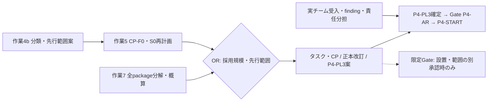

# Phase 4入口・Framework先行範囲の整理案（2026-10-02）

**状態:** DRAFT / 作業4bのreview入力。分類・先行対象・Gate変更・Phase 4開始は未承認。
**Ownership:** Framework側の計画文書。実装とEvidenceのOwner候補はpackageごとに分ける。
**確認baseline:** `docs/daily-development-workflow` / `dbee2bf`。文書・承認記録の照合のみ。新しいfixture・Maven実行は行っていない。
**正本との関係:** 採用支援の作業順・状態は[作業順序案](pre-phase4-framework-independent-work-review-20260930.md)、当初成果物・DoDは[グランドデザイン§27.8](../architecture/grand-design/KOIKI-JavaWeb-FW_グランドデザイン_v0.2.md#278-phase-4-enterprise-integrationv04)。本書は[見直し草案](KOIKI-JavaWeb-FW_Phase4実施計画_見直し草案_v0.1.md)と[F-5台帳](phase4-pl2-f5-integration-and-gate-delta-draft.md)を変更する前の比較材料である。

**後続判断（2026-10-02）:** S1の検証完遂を目指す進め方を候補とすることはOwnerが決定・承認した。[決定記録](phase4-s1-completion-direction-decision-20261002.md)を入力に、作業5・7で具体化する。先行範囲・Gate・個別開始は別判断である。

## 1. 入口の整理と今回の出口

**目的:** 案件アプリチーム・顧客判断との接点を把握しつつ、Framework側で成立条件を揃えられる範囲を、案件の判断時期に連動させず着実に進捗させる。2026-10-02にOwnerが、この目的と、アプリチームとの協調・FAQ対応を継続しながらフィージビリティを確保して進める意図を示した。

案件側の入力待ちは必要な対象に限定し、独立したFramework / Reference / Toolingの計画全体を止める条件にしない。案件からの回答・問い合わせは担当対象へ反映し、既存共通契約の欠陥や共通の前提を変える事項が確認された場合は、その影響範囲をreviewする。

Framework側の進捗は、成果物・検証出口・担当・実行環境・作業上限を揃え、packageごとの成立を確認して積み上げる。先行対象の優先順は案件の予定日より、独立性、DoDへの寄与、実証可能性、担当・環境の準備状況を根拠に決める。

採用支援とPhase 4本体の計画を分ける。作業4aまでの文書承認をproduction開始へ読み替えない。

| Track | 現在の到達点 | 今後の扱い |
|---|---|---|
| 採用支援 | ガイド2冊の提供、日常開発方式の比較、依存制御の整理、認証profileガイド追加差分の文書承認 | 日常開発方式は採用・実装の別判断待ち。依存制御は案の共有・認識合わせを進め検証作業保留。認証方式とLinux実証は実チーム入力待ち |
| Phase 4本体の計画 | PL1契約差分、PL2のLevel 2 Tooling Evidence、F-5全件台帳、S0の暫定基準 | 作業4bで必要入力を分類し、作業5でCP-F0・DoD差分、作業7で設計・検証・概算を揃えて一体review |
| Phase 4本体の実行 | 未開始 | 現行Gate経路、または別途改訂・承認した限定Gateに従う |

今回の出口は、全件の必要入力・Owner候補・DoD・開始経路を追える分類案と、案1 / 案2の比較である。作業5の判断材料は文書化したが、作業7の全件分解・概算は未完了のため、Owner review（OR）の提出完了にはしない。

**継続状況:** 作業5の[CP-F0判断材料・S0再計画案](phase4-cpf0-and-s0-replan-options-20261002.md)をDRAFTとして作成した。作業7の全件分解・概算は未完了であり、担当・上限・環境を揃えてから本書の対象・順序を最終整理する。

## 2. 全packageの必要入力と開始境界

作業順序案§3.1.2の区分を引き継ぎ、A＝顧客入力なしで計画を進め得る、B＝顧客入力待ち、C＝採用trigger / Owner判断待ちとする。区分は開始許可ではなく、同じpackageにも複数の待ち条件がある。Owner欄は役割候補で、担当者の指名・予算確保ではない。

| 当初ID / package | 区分・必要入力 | 実装 / Evidence Owner候補 | DoD・依存 | 開始前の未決事項 |
|---|---|---|---|---|
| P4-01 / A1・A2 | C：CP-F0のS0 / S1 / S2。Referenceの実証目的は案件通知需要と分ける | A1 Framework / Tooling、A2 Reference / Tooling | 4-1〜4-5・4-12。A2はA1依存、非同期D1と統合実演 | publication / schema、復旧安全性、event、provider stub、Rules / API、担当・上限 |
| P4-02 / C0・C1 | C：MyBatis adoption trigger | C0 Architecture / Framework、C1 Reference / Tooling | 4-6。現行C1案はA1にも依存 | trigger前はRule 8拒否を維持。S0時の非同期連携・順序を作業5で再計画 |
| P4-03S / B1 | A：Referenceとして設計可能 | Reference / Tooling、FrameworkはSecurity契約review | 4-8・4-9。same-origin Session SPAとMVC併用 | 当初DoD維持の最終判断、route別CSRF、frontend構成・検証手段。Customer BFFで代替しない |
| P4-03B / B2 | B：CustomerのAPI・認証・環境、P4-AR6 / AR-D10 | Customerが設計・実装・Evidence、Frameworkはgap審査 | 独立DoD番号なし。B1とは別track | 非機密Evidence、受入側とFramework側の責任分担。案件設定をFrameworkへ移さない |
| P4-04 / X | B：PL1-Q6のIdP方式・認証終端 | Customer設計入力、Architecture採否、必要なFramework拡張は別review | 当初SAML成果物、番号なし | OIDC / brokerで足りるか、直接SAMLが必要か。作業4aの承認は採用判断ではない |
| P4-EDGE / X | B：ALB採用とKOIKIへ届く認証情報 | Customer / cloud / platform、Framework境界review | 番号なし、後続割当のOwner判断が必要 | IdP JWTとALB署名claimの区別、network、実環境、Adapter Owner。ALBを使うだけでAdapter必須としない |
| P4-05 / C2 | A：Referenceの模擬接続先・失敗semanticsを決めれば計画可能 | Framework契約review、Reference / Tooling実演 | 4-7。A1に独立して設計可能 | library review、timeout / retry / 流量制限、冪等性、失敗応答。実provider条件はCustomer側 |
| P4-06 / C3 | A：Reference jobを定義。運用入力も必要 | Reference / Tooling、Framework境界review、運用Owner | 4-10。A1パージと実行基盤を照合 | job・metadata schema・単一実行・再実行・運用担当。S0なら通知reminder以外のjob候補を作業5で比較 |
| P4-07 / C4 | A：Referenceの代表use caseに限定。案件固有部分はB | Reference / Tooling、Framework境界review | 番号なし。当初成果物として採否を追跡 | 代表操作、保存・失敗・cleanup / Audit。実bucket・format・権限やAWS固有Adapterを推定しない |
| P4-08 / D1非同期 | C：CP-F0、A1 / A2の採用 | Framework / Tooling、Referenceの統合Evidence、運用Owner | 4-4・4-12の観測面、A1と同時設計 | FAILED metric、相関、cardinality・非露出、sink・alert担当。S0ならLevel 2固有部分は開始しない |
| P4-08 / D1同期・OpenTelemetry | A：顧客入力なしで範囲設計可能。運用入力待ちあり | Framework / Tooling、運用Owner | 独立DoD番号なし。当初OpenTelemetry成果物 | S0でも自動除外しない。採否、tracer / exporter、検証sink・費用、既存Observabilityとの境界 |
| P4-09 / D3 | A：package済みReferenceに限定。platform入力待ちあり | Reference / Tooling / platform | 番号なし。当初Container / ECS成果物 | 検証場所、secret・network・resource Owner、費用とcleanup。実案件受入Evidenceとは別 |
| P4-10 / D2 | A：Framework / Toolingで計画可能。CI判断待ち | Framework / Tooling / CI Owner | 4-11。既定無効を維持 | runtime対象、pinning、CI系統・費用、required check / workflow変更の別承認 |
| P4-11 / E1 | B：実チーム受入、release / platform入力 | Framework release / Architecture、Customer受入 | 番号なし。正式受渡し判断 | 対象、repository、version / checksum、support。R2 stage・内部snapshotを正式releaseにしない |
| P4-OPT / X | C：Authorization Server / Oracleの個別trigger | Architectureと採用対象のOwner | 必須DoD外 | P4-AS0 / P4-ORACLEまで開始しない |

この表はFramework本体への昇格一覧ではない。Reference機能、Customer設定、Tooling検証を正式Starter / APIへ移すには別の根拠とreviewが必要になる。実装の技術選定・version・配置は作業7と各blocking reviewで具体化する。

## 3. CP-F0と先行範囲を分けて判断する

CP-F0はLevel 2の必要性・規模を決める判断であり、先行Gateの対象とは別軸である。2026-09-27のPL2のS0は当時の暫定基準で、Owner決定ではない。

その後のOwner判断により、S1完遂を目指す進め方の候補化は承認済みとなった。以後はこの方向で具体的条件を計画し、CP-F0の残項目と開始経路を判断する。S2は案件設計から並走して適合確認し、共通拡張が必要な場合に別判断する。C3 / C4はnon-Web＋Batch Frameworkの連携検証を主候補とし、Web内組込みは可能だが非推奨の例外候補とする。詳細・承認範囲は[決定記録](phase4-s1-completion-direction-decision-20261002.md)を参照。

実機能・想定利用場面・現時点の利用可能性は、[CP-F0判断材料§1.2〜1.3](phase4-cpf0-and-s0-replan-options-20261002.md#12-実機能想定利用場面利用可能性で読むs0--s1--s2)を参照する。S0は既存の同期業務処理を維持し、S1は限定した承認後通知の正式Reference実証、S2は複数Consumer向けの共通提供を目指す。S1 / S2の機能像は現在提供済みの機能ではない。

| 選択候補 | 先行範囲への影響 | 未達・再計画への影響 |
|---|---|---|
| S0：Level 1維持 | 現行P4-F案のA1 / A2 / D1非同期を開始しない | 4-1〜4-5・4-12は未達として残る。延期・変更とC1 / Batch依存の扱いを作業5で提示 |
| S1：用途限定Level 2 | A1 / A2 / D1の限定範囲を候補にできる | Reference対象event、復旧・冪等性、実施Owner・上限が必要。手動復旧で核心DoD 4-2 / 4-3を省略しない |
| S2：共通基盤 | Framework共通提供と独立Consumer等の追加が必要 | 独立利用先の需要・support・S1との差分を示して別評価。既存見積を流用して予算確定しない |

S0を選んでも、4-6〜4-11の必要性や、番号なし成果物の採否は自動的には変わらない。特にMyBatisの4-6には独立triggerが残る。4-7〜4-11を先行しても、当初のPhase 4全体を完了したことにはならない。

## 4. 現行Gate維持と先行範囲再定義の比較

| 比較軸 | 案1：現行Gate維持 | 案2：P4-F対象を顧客入力非依存packageへ再定義 |
|---|---|---|
| S0の場合 | A区分もP4-AR6 → 責任分担 / 計画確定 → Gate P4-AR → P4-STARTを待つ | A区分から、入力・担当・上限・停止条件が揃うpackageだけをOwnerが選ぶ |
| S1 / S2の場合 | 現行提案のA1 / A2 / D1についてP4-Fの設置・承認を別審査 | A1 / A2 / D1に他packageを加えるかも対象ごとに審査 |
| 対象候補 | S0では先行実装なし。計画・設計は継続 | B1、C2、C3、C4、D2。D3・D1同期はplatform / 運用入力が揃う場合に限る。全件を一括開始しない |
| 準備負担 | Gate構造は維持。ただしDoD・依存再計画と全件分解は必要 | 全件分解から選んだ対象の設計・概算範囲または上限・Owner・Evidence・停止点を揃える |
| 正本への影響 | S0の場合P4-F例外を追加しない。採否・DoD変更は別記録 | P4-AR計画、AGENTS.md、project-overview Skill、見直し草案§4.3、F-5文案、P4-F提案 / 判定資料の整合改訂が必要 |
| 利点 | 受入・責任分担と実装開始の既存順序を維持 | 実チーム受入の時期から独立して、承認したFramework / Reference実証を前進させ得る |
| 制約 | 準備が整ったA区分でも実装は受入時期に連動 | 担当・platform・CI費用がなければ開始できない。未達DoD、案件受入、正式受渡しは解消しない |

**検討上の提案:** §1の目的に沿って、案2を先行範囲の具体化に向けた検討の軸とする。作業5・7でA区分の独立性・検証出口・担当・環境・上限を揃え、案件判断を待たずに成立させられる対象と優先順を示す。案1は比較対象として残し、改訂・承認まで適用する現行Gate経路は維持する。今回の目的の確認を、案2の正式採用・Gate設置や個別packageの開始承認として扱わない。

案2には、対象の必要入力が全て揃うこと、他packageの未承認契約へ依存しないこと、package単位で検証・停止できること、Customer受入を代替しないことが必要である。顧客入力なしでも運用・platform入力が残るため、「区分Aだからすぐ開始できる」とは説明しない。

### 4.1 フィージビリティを維持する進め方

| 確認する軸 | 作業5・7で具体化すること |
|---|---|
| 独立性 | 顧客入力、運用 / platform入力、Framework自身の採用判断を分ける。依存する契約と、Referenceの模擬で閉じられる部分を明示 |
| 実証可能性 | package単位の成果物と正常・異常の検証出口、環境・cleanup、Evidenceの保管先を定める |
| 実施可能性 | 実施・review・運用の担当候補、作業分解・上限、CI / platform費と未取得事項を示す |
| 継続判断 | 各区切りで実測・残課題・依存の変化を確認し、範囲や順序を見直す。未成立の対象だけを保留し、独立した対象は進める |
| 案件との協調 | FAQと契約説明を継続。案件固有の採否・受入は案件側と確認し、共通契約への影響があるfindingを本体計画へ戻す |

共通機能の採用理由は、Frameworkの当初成果物・DoDとReferenceでの実証目的からも説明する。実案件がまだ要件化していないことだけを、Framework側の必要性がない根拠にしない。Level 2等の採用規模もこの区別を保ち、Framework自身の成立条件と案件への導入条件を別々に判断する。

## 5. 作業5・7で追加する判断材料

**追加の統合材料（2026-10-05）:** [作業4b・5・7：先行範囲／CP-F0統合判断材料](phase4-forward-scope-cpf0-integrated-review-draft-20261005.md)へ、S1と他packageの対象・依存・実演・概算、先行順序・Gate経路・共通費・残判断を統合した。状態はDRAFT。初回S1限定と独立候補の段階追加を比較する提案であり、本書の案1 / 案2の採用・Gate改訂・OR完了ではない。

| 担当する計画作業 | 今回から渡す材料 | 次に揃えるもの |
|---|---|---|
| 作業5 | §2のA1依存、§3の未達DoDとS0 / S1 / S2 | Level 2の必要性、S0時のDoD延期 / 変更案、C1の連携範囲と順序、Batch job候補、再評価条件 |
| 作業7 | §2の全package・入力 / Owner候補、§4の先行候補 | packageごとの設計論点、成果物Ownershipと配置候補、blocking review、検証環境 / 正常・異常Evidence、停止点、作業分解・概算と根拠 |
| 作業4bの最終整理 | §4の2案 | 作業5・7の結果で先行対象とGate改訂差分・見積材料を更新し、ORへ一体提出 |

概算は標準人日、AI支援のOwner稼働、外部待ち、CI / platform継続費を区別する。未取得値を0としない。本書では新しい工数値を作らず、[PL2判定資料](KOIKI-JavaWeb-FW_Phase4_PL2_P4-F判定資料_v0.1.md)の既存見積境界を引き継ぐ。

## 6. 後続の正本改訂差分とOwner review

現時点ではR1〜R7、見直し草案§4.3、F-5の既存文案、AGENTS.md、Skill、P4-AR計画を変更しない。ORの結果に応じて作業9で差分を提示する。

| 改訂先 | 提示する差分の内容 |
|---|---|
| 見直し草案の入口・状態 | 採用支援の作業順は作業順序案を参照。作業2の別判断待ち、作業3の保留、作業4aの文書承認を本体の開始条件と混同しない |
| 見直し草案のpackage / Gate | §2の必要入力、作業5のDoD・依存差分、採用した案1 / 案2と対象を反映。D1同期 / 非同期を区別 |
| 判断記録 | R1〜R7を保存し、CP-F0・先行範囲・DoD差分の判断をR8以降として追加 |
| F-5・P4-F・Agent guidance等 | 案2採用時はLevel 2専用の条件を対象packageごとに改訂。正式な設置・開始承認は対象 / 期限 / Owner / Evidence / 停止条件とともに記録 |

ORでは、CP-F0と案1 / 案2を同じreviewで判断する。ただし今回の作業4b文書だけでは、作業5・7の未完成材料、実施Owner、限定作業の上限を補えないため、Gate判定やproduction開始の承認を求めない。
実チーム受入・AR-D10・P4-PL3確定・Gate P4-AR・P4-STARTは既存経路に残す。push / PR / merge、workflow / ruleset変更、snapshot publishと正式配布は個別判断のままである。
