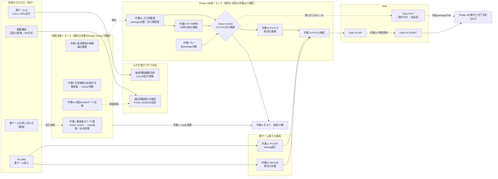
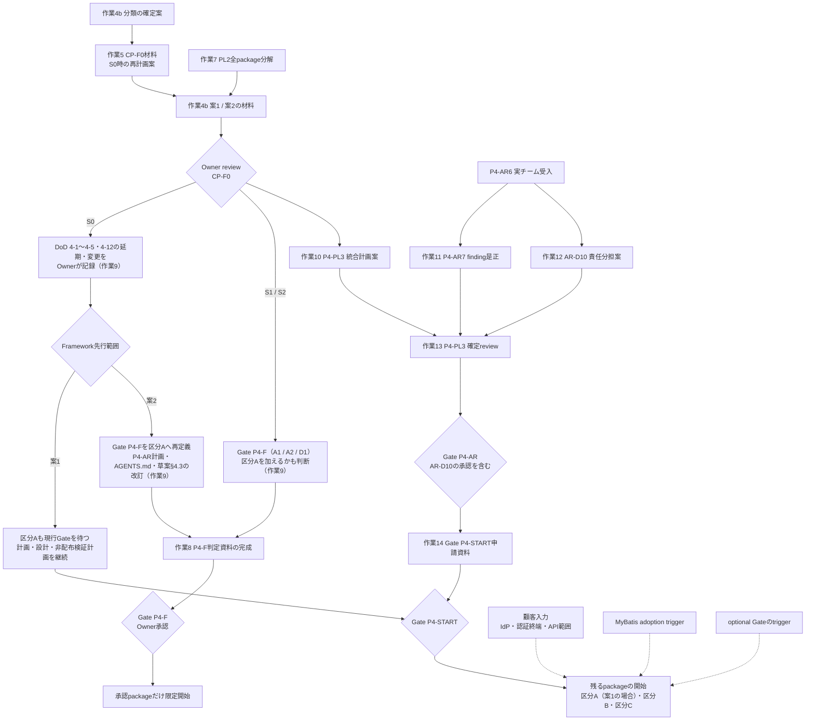
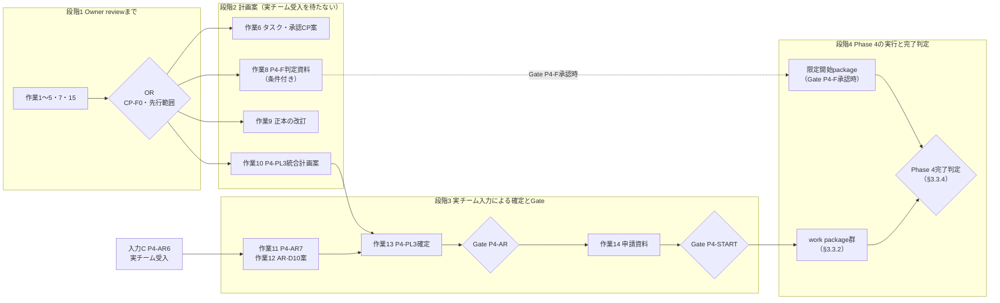
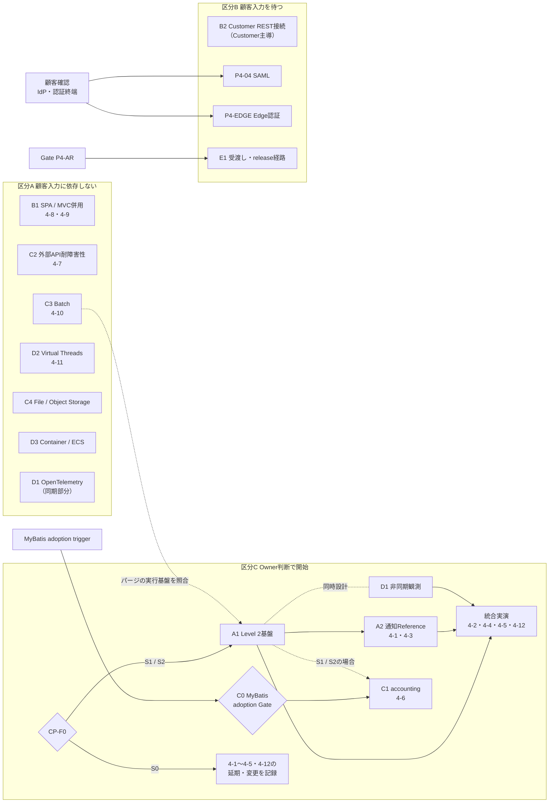

# Pre-Phase 4 Framework側の現在地と作業順序案（2026-09-30）

**状態:** OWNER APPROVED / 2026-09-30。承認範囲は§7のとおり。個別タスク、承認CP（作業6）、Phase 4開始判断は別途提案する。
**初稿作成branch:** `docs/adoption-developer-guides-and-plan`（`main` / `6788ecd`から作成。PR #41で`main`へ反映済み）
**継続作業branch:** `docs/daily-development-workflow`（`main` / `217cd0c`から作成。作業1〜3の進捗は§8〜§10、2026-10-02の今後の作業一覧は§11）
**関係する既存の順序表:** [Development README「次の着手順（2026年9月29日時点）」](README.md#次の着手順2026年9月29日時点)。本書§5で対応を示す。

## 0. 要約

- 実案件チームはReference Applicationの起動などに着手した。実案件開始は2026年11月予定。
- 実チームからの回答（認証終端、IdP方式、実環境でのbuild / run結果）は未取得。回答を待つ間、Framework側は**単独で完結する作業**を進める。
- 実チームからの問い合わせは都度受けるが、問い合わせを理由に作業順・期限・Gateを組み替えない。安全性や既存契約の欠陥が再現された場合だけ、別途影響をreviewする。
- 優先するのは**開発者向け文書**と、**開発の日常作業を妨げる未決事項**（IDEでの依存解決、編集からtestまでの反復方法）の整理である。Linux / WSLでのbuildは実チームが先に試行し、その結果を取り込む。期限と完了範囲は作業量を見て、タスク・承認CP案とともに定める。
- Phase 4本体では、PL2がCP-F0の暫定基準をS0（Level 1維持）とした。現行案のFramework先行Gate（P4-F）はLevel 2だけを対象にしているため、S0になると先行して実装できるpackageがなくなる。顧客入力に依存しないpackageをどう扱うかを、CP-F0と合わせて再検討する（§3.1）。

### 0.1 全体の見取り図

作業は、採用支援とPhase 4本体の2トラックで進む。Phase 4本体は、Owner reviewで計画の方向を決め、
実チーム受入の結果を加えてP4-PL3を確定し、Gate P4-AR・Gate P4-STARTを経てPhase 4の実行と完了判定へ進む。
実線は「完了が次の前提になる」関係、点線は「入力・材料になる」関係を表す。

- 個々の作業と待ち事項の段階・前提・出口・状態は§3.2の一覧で確認する。
- Owner reviewの分岐と、その結果に応じて発生する作業8・作業9は§3.1.4の図で示す。
- Phase 4の実行から完了までの見通しは§3.3で示す。

## 1. 現在地

作業1の状態は2026-10-01の進捗を反映した。その他は2026-09-30時点の記録である。

| 領域 | 到達点 | 未完了・境界 |
|---|---|---|
| Phase 3 | Reference Vertical Sliceとremote closeoutは`COMPLETE / ACCEPTED` | 再オープンしない |
| P4-AR（Framework側） | AR-1〜AR-7は`COMPLETE / OWNER APPROVED`。R2受渡し契約とToolingを検証済み | [実チーム受入worksheet](p4-ar6-actual-team-reception-worksheet.md)は`PENDING`。AR-D10、Gate P4-ARは未完了 |
| 外部project検証 | 外部ReferenceとReference非依存のgreenfield bootstrapで、隔離Maven stageからbuild / runを実証 | 検証projectはGit未管理のfixture。実案件Repositoryでの結果ではない |
| 開発者向け文書 | [アプリケーション開発者ガイド](application-developer-guide.md)と[Architecture Rules説明](architecture-rules-developer-guide.md)のOwner reviewは2026-09-30完了。PR #41で`main`反映、PR #42でREADME整合済み。既存の引継ぎガイド・開発環境構築手順に加え、新設2冊の社内Repository同期も完了（Owner報告）。FAQ配置方針を決定し、作業1は完了（§8） | 本branchの承認状態・FAQ節等の文書更新は後続の`main`反映・社内同期対象。Linux / WSL手順は実チームが試行予定。IDE依存解決の方式は未決定 |
| Phase 4計画 | [見直し草案](KOIKI-JavaWeb-FW_Phase4実施計画_見直し草案_v0.1.md)のR1〜R7、PL1 REST境界、PL2非配布検証・F-5台帳を整理済み。CP-F0の暫定基準はS0（Level 1維持） | Gate P4-Fは提案段階で、対象はLevel 2のA1 / A2 / D1に限られる。S0の暫定基準、Level 2、DoD変更、production実装、正式配布は未承認 |
| 実案件との接点 | 9月28日の説明会でfrontend / backend分離、BFF + REST、JWT、Repository並列配置の方向性を共有 | 認証終端、IdP方式、API範囲、実チームのbuild / run / diagnosis結果は未取得 |

## 2. 開発者向け文書の点検結果

既存文書を「開発者が業務機能を作り始めるまでの道のり」に沿って点検した。

| 開発者の場面 | 既存文書の状態 | 対応 |
|---|---|---|
| KOIKIの提供範囲とOwnershipを知る | 引継ぎガイドが第一入口として機能している | 変更しない。新設ガイドへのリンクだけ追加 |
| 開発環境を作り初回buildを通す | 開発環境構築手順がWindows / VS Codeで具体的。Linux付記は未検証と明記済み | 変更しない。実チームのLinux / WSL試行結果を受けて該当箇所を更新する（§4） |
| 業務機能を1つ作る | 設計の問いは引継ぎガイド§8、責務配置はAgent Skill、package構成はReferenceとFeature Templateに分散し、**「どこに何を置き、どう検証するか」を一続きで説明した文書がなかった** | [アプリケーション開発者ガイド](application-developer-guide.md)を新設 |
| ArchUnit違反を理解して直す | 実装とValidation記録はあるが、開発者向けの日本語説明がなかった（説明会アクション） | [Architecture Rules説明](architecture-rules-developer-guide.md)を新設 |
| 毎日のbuild / testを回す | 合否はR2で判断し、IDE依存解決は「未決定事項」と記載されている。**R2を毎回実行する以外の手順がない** | 文書ではなく方式の決定が必要（§3 作業2） |
| 認証profile / RESTを詳細設計する | profileガイド、Phase 2 Journey、PL1台帳がある。認証終端の設計観点は[見直し草案§8](KOIKI-JavaWeb-FW_Phase4実施計画_見直し草案_v0.1.md#8-新しい入口へ引き継ぐ設計観点-認証の終端とbffkoiki間の検証)に整理済みだが、profileガイドへは未反映 | 顧客入力を要しない部分をprofileガイドへ反映する（§3 作業4a）。採否の判断は顧客入力待ち |

新設2冊を作る際に実装と照合し、次の2点を文書へ反映した。

- **Architecture Rules testは2つ必要である。** Customerが`businessModuleRules`だけを実行すると、`internal`参照を検出するRule 013が実行されない。R2と開発環境構築手順§5.2は両方の実行を求めている。説明文書のtest例は両方を含めた。
- **ルールはpackage名で役割を判定する。** 所定外のpackage名に置いたclassは依存方向の検査から漏れる。このため開発者ガイドでは、package構成をReferenceの模倣ではなくKOIKIとの約束として示した。

追加の開発者向け文書は、実チームの問い合わせや試用で詰まった箇所を根拠に増やす。現時点では一律の文書群を先行作成しない。

## 3. Framework側で単独に進める作業と順序案

| 順 | 作業 | 成果物・完了条件 | 実案件入力との関係 |
|---:|---|---|---|
| 1 | 開発者向け2冊の仕上げと提供 | 2冊のOwner reviewを終え、`main`へ反映し、社内Repositoryへの同期に含める。これを完了とする。以後の改訂は実チームの問い合わせを材料に継続して行う | 単独で進められる優先作業。期限と完了範囲は作業量を踏まえ、タスク・承認CP案で定める。`main`への反映と同期はremote操作として個別承認に従う |
| 2 | 日常開発の反復方式の整理 | IDEでのKOIKI依存解決と、編集からtestまでの反復方法について、選択肢（`~/.m2`へのinstall、日常用stage、その他）とOwnership・更新・破棄の方法を比較し、推奨案を提示 | 実チームが開発を始めると最初に当たる。方式の決定はOwner判断。Toolingの実装は承認後 |
| 3 | 依存関係の制御の論点整理 | `pom.xml`への依存追加でFramework制約を回避できる範囲と、Architecture Rulesが検出する範囲・しない範囲を整理（Architecture Rules説明§5を起点にする） | 説明会の未確定事項。方針の決定は継続検討 |
| 4a | 認証profileガイドへの設計観点の反映 | [見直し草案§8.5](KOIKI-JavaWeb-FW_Phase4実施計画_見直し草案_v0.1.md#85-新しい入口の作業で行うこと)の1・2として、ALB + BFF（Profile E＋B）の比較、claim条件、sessionとlogout、判断記録様式の追加をprofileガイドへ記載する | 顧客入力を要しない。実チームが認証の詳細設計を相談する際の前提資料になる。§8.5の3（P4-EDGE / P4-04の採否）は§4の顧客確認を待つ |
| 4b | Phase 4入口の再整理とFramework先行範囲の再検討 | (1) P4-PL3の入口として、採用支援とPhase 4本体の2トラック、未完了Gate、PL1 / PL2からの入力を一枚で追えるようにする。(2) Phase 4の全packageを顧客入力への依存で分類し、Framework / Referenceが先行できる範囲と、その開始に必要なGate・Owner判断を示す（§3.1）。(3) 見直し草案を改訂する場合は、採用支援トラックの正本として本書を参照する差分案にする | 案まで単独で進める。確定はOwner判断。作業5と一体でOwner reviewへ出す（§3.1.4） |
| 5 | CP-F0の判断材料とS0時の再計画案 | F-5全件台帳、Level 2のS0 / S1 / S2、CP-F0で必要な需要・運用Owner・DoD差分を揃える。暫定基準のS0を採る場合に備え、未達となるDoD 4-1〜4-5・4-12の延期・変更案と、A1に依存するC1・Batch reminderの順序の再計画案を作る（[F-5§2.3](phase4-pl2-f5-integration-and-gate-delta-draft.md#23-phase-4実施計画へ提案する差分)） | 通知需要は未取得として保持。実案件の予定日でLevel 2を決めない。作業4bと一体でOwner reviewへ出す（§3.1.4） |
| 6 | タスク・承認CP案の作成 | 作業1〜5・7の成果とOwner reviewの結果、作業量を見て、Owner、Evidence、停止条件、remote操作の個別承認点を提案 | 実チーム受入に依存する判断は未完了のまま記載 |
| 7 | PL2での全packageの分解 | P4-01〜11とoptional項目のうち、A1 / A2 / D1以外のpackage（B1、C2、C3、C4、D2、D3、E1、P4-04、P4-EDGE等）について、設計論点、前提、blocking review、検証環境、DoDの実演単位、概算を作る（[見直し草案§4](KOIKI-JavaWeb-FW_Phase4実施計画_見直し草案_v0.1.md#4-framework側の再開順序案)のPL2定義、同§6の完了条件3） | 顧客入力を要しない分析。区分Bのpackageは待ち条件を明記して分解する。作業4b・5と並行し、案1 / 案2の材料と工数の根拠にする |

作業1〜4aは独立しており、並行してよい。順は、実チームの開発に近い影響を持つものを先にした。
作業4bと5は互いの結果に依存するため、§3.1.4の順で進めて一体でreviewする。作業7は作業4b・5と並行する。
作業8以降は、Owner reviewの結果と実チームの入力を受けて発生する作業であり、§3.2の一覧と§3.3の見通しで管理する。
承認済み契約を変える改訂やproduction実装は、どの作業でも既存Gateに従う。PL2のfixture PASSを正式DoDやPublic API採用へ読み替えない。

### 3.1 Framework先行範囲の再検討（作業4b・作業5）

#### 3.1.1 現在の位置付けと問題

見直し草案とPL2の成果物は、Framework先行を次の2段階で扱っている。

| 段階 | 内容 | 根拠 |
|---|---|---|
| 計画作業 | P4-PL0〜PL2の調査・設計と、非配布fixtureの検証計画まで。production code、Public API、migration、dependency、Starter、workflowは変更しない | [見直し草案§3冒頭・§4](KOIKI-JavaWeb-FW_Phase4実施計画_見直し草案_v0.1.md#3-当初phase-4案件の棚卸し) |
| 限定的なproduction先行 | Gate P4-F（未承認の提案）。対象はA1 Level 2基盤、A2通知Reference、D1非同期観測に限る | [見直し草案§4.3](KOIKI-JavaWeb-FW_Phase4実施計画_見直し草案_v0.1.md#43-p4-ar6を待たないframework限定開始gate案)。R6は提案の作成だけを承認 |

上記以外のpackageは、P4-AR6実チーム受入 → Gate P4-AR → Gate P4-STARTを経てから開始する（見直し草案§4.1.1）。

一方、PL2はCP-F0の暫定基準をS0（Level 1維持、Level 2のproduction開始見送り。未承認）とした。
[F-5§2.2〜§2.3](phase4-pl2-f5-integration-and-gate-delta-draft.md#22-agentsmdへ提案する文案)の文案では、S0を選んだ場合はGate例外を設けず、P4-FのLevel 2開始を提案しない。
このため、**S0が選ばれると、Framework / Referenceが先行して実装できるpackageがなくなり、Phase 4本体のproduction作業はすべてP4-AR6の実チーム受入の時期に連動する。**

P4-Fの対象をLevel 2に絞ったのは、A1がA2とC1の共通前提（R5）であり、Phase 4の実装順の起点だったためである。
S0ではその前提が変わるため、先行範囲の選び方を「Level 2を起点にする」から「顧客入力への依存で分ける」へ見直す必要があるかを確認する。

#### 3.1.2 顧客入力への依存によるpackage分類（案）

作業4bでは、次の分類を起点に各packageの必要入力、DoD、依存を確認し、確定案にする。
この分類は開始の承認ではない。区分Aのpackageも、開始前にはblocking reviewと、下表右列の判断・入力を要する。

**区分A: 顧客入力に依存しない（Framework / Reference / Toolingで完結し得る）**

| Package（DoD） | 顧客入力なしで進められる理由 | 開始前に必要な判断・入力 |
|---|---|---|
| B1 SPA / MVC併用Reference（4-8・4-9） | Reference所有。R4で、当初DoD（same-origin Session SPA、CSRF double-submit、Thymeleaf併用）をReferenceで検証する方針が承認済み。実案件BFF（B2）のEvidenceとは分離済み | Security routeとfrontend実証方法のreview。当初DoDを維持することの最終確認 |
| D2 Virtual Threads（4-11） | Framework / Toolingで閉じる。既定無効のbaselineを維持する | CI系統・required check変更の個別承認と費用。pinningとruntime互換の確認範囲 |
| C3 Batch（4-10） | Referenceのjobで実証する前提。S0でもDoD 4-10は残る | job起動基盤、metadata schemaの所有、運用Owner。当初候補のうち未処理申請リマインドはA1（通知）に依存するため、S0では実証jobの選び方を作業5で再計画する（月次締め等） |
| C2 外部API耐障害性（4-7） | 接続先と失敗semanticsをReference側の模擬として定めれば進められる | Resilience4j等の第三者library review。Customer固有Adapterは対象外 |
| C4 File / Object Storage（番号なし） | Referenceの代表use caseで実証できる | 代表use caseの選定。実保存先・format・権限はCustomer入力のため対象外。AWS固有Adapterは作らない |
| D3 Container / ECS Reference（番号なし） | package済みReferenceで実証できる | platform、network、secret、resourceのOwnerと検証場所。顧客ではなく運用・platform側の入力が要る |
| D1のうち同期部分（OpenTelemetry、番号なし） | Phase 1b Observability baselineからの拡張として扱える | 当初OpenTelemetry成果物の採否、exporter / alertのOwner（[F-5§1](phase4-pl2-f5-integration-and-gate-delta-draft.md#1-phase-4全件の採否dod待ち条件)のP4-08行） |

**区分B: 顧客入力を待つ（論点整理と契約設計は先行できる）**

| Package | 待っている入力 | 先行できること |
|---|---|---|
| B2 Customer REST接続 | Customer主導のAPI範囲・認証方式・環境。P4-AR6 / AR-D10での責任分担 | 公開済み契約の説明とgap審査 |
| P4-04 SAML / 外部IdP | IdP方式と認証の終端（PL1-Q6） | 作業4aのprofileガイド反映、OIDC優先との適合整理 |
| P4-EDGE Edge認証 | 実案件がALB認証を採るか（PL1-Q6） | 署名済みedge claim、ALB ARN、直接到達の防止等の契約整理 |
| E1 受渡し・release経路 | P4-AR6実チーム受入、release / platform Owner | P4-AR inventoryとR2 stageの限界の整理 |

**区分C: Owner判断を待つ**

| Package（DoD） | 待っている判断 |
|---|---|
| A1 / A2 / D1の非同期部分（4-1〜4-5・4-12） | CP-F0のS0 / S1 / S2 |
| C0 / C1 MyBatis・accounting（4-6） | MyBatis adoption trigger。C1は当初A1にも依存し、S0なら非同期連携の範囲と順序を再計画する |
| P4-OPT Authorization Server / Oracle | 各optional Gateの明示trigger |

#### 3.1.3 S0の場合の選択肢

S0が選ばれた場合に、区分Aをいつ開始できるかについて、次の2案を比較してOwner判断に付す。

| 案 | 内容 | 利点 | 留意点 |
|---|---|---|---|
| 案1: F-5文案どおり現行Gateを維持 | S0ではGate例外を設けない。区分Aの開始もP4-AR6 → Gate P4-AR → Gate P4-STARTを待ち、それまでは計画・設計・非配布検証計画を進める | P4-AR計画、`AGENTS.md`、見直し草案のGate構造を変えない | Phase 4本体のproduction作業は実チーム受入の時期に連動する。区分Aの準備が整っても着手できない |
| 案2: P4-Fの対象を区分Aへ再定義 | P4-Fを「Level 2限定」から「顧客入力に依存しないFramework / Reference packageの限定開始Gate」へ改め、区分Aから対象packageを選ぶ | 実チーム受入を待たずに、DoD 4-7〜4-11の一部を前進できる | P4-AR計画、`AGENTS.md`、見直し草案§4.3の改訂とOwner承認が必要。S1 / S2を前提に書かれたF-5§2の文案を書き直す。対象packageごとに、PL2と同じ粒度で設計・工数の上限・停止条件・Evidenceを揃える |

どちらの案でも、P4-AR6、AR-D10、Gate P4-AR、Phase 4全体の開始、正式受渡しを完了扱いにしない。
S1 / S2が選ばれた場合も、既存のP4-F案（A1 / A2 / D1）に区分Aのpackageを加えるかを同じ観点で判断する。

#### 3.1.4 作業4bと作業5の進め方

P4-Fに何を含めるかはCP-F0の結果で変わる。また、S0を選ぶ場合の再計画案は、区分Aのpackageをどう扱うかで変わる。
このため次の順で進め、Ownerへは一体で提出する。

1. 作業4b: §3.1.2の分類を、各packageの必要入力・DoD・依存とともに確定案にする。
2. 作業5: CP-F0の判断材料と、S0時の再計画案（未達DoDの延期・変更、C1・Batchの順序）を作る。
3. 作業4b: 1と2を受けて、§3.1.3の案1 / 案2それぞれの対象package、必要なGate改訂、工数見積に要る材料を示す。
4. Owner review: CP-F0（S0 / S1 / S2）とFramework先行範囲（案1 / 案2）を同じreviewで判断する。

判断の分岐と、各packageが開始できるまでの経路は次のとおり。菱形はOwner判断、点線は入力を表す。
どの経路でも、限定開始の対象は承認記録に列挙したpackageに限られ、各blocking reviewと個別承認を経る。
Owner reviewの結果に応じて、次の作業が発生する。

- **作業8 P4-F判定資料の完成:** S1 / S2、または案2を選んだ場合に、対象packageの限定作業の上限、実施Owner、停止条件を揃える。
- **作業9 判断に伴う正本の改訂:** DoDの延期・変更を記録する場合は、グランドデザイン§27.8と該当ADRとの整合を取る。P4-Fを設置する場合は、P4-AR計画、`AGENTS.md`、project-overview Skillを改訂する。いずれの場合も、見直し草案へ新しい判断記録（R8以降）を追加する。

#### 3.1.5 この再検討で行わないこと

- Owner review済みの見直し草案（R1〜R7）とF-5の文案を、Owner判断の前に書き換えない。改訂が必要な場合は差分案として示す。
- 区分Aに分類したことを、開始の承認、DoDの変更、Public API / dependency / migration / Starter / workflowの変更承認として扱わない。
- 実案件の開始時期を理由に、Level 2の採否やFramework先行範囲を決めない。

### 3.2 作業・待ち事項・Gateの一覧

§0.1、§3.1.4、§3.3の図に現れるすべての項目を、次の一覧で管理する。項目を追加・完了したときは、図とこの一覧を合わせて更新する。
IDの番号は追加した順であり、実行の順序は「段階」列で示す。状態は2026-09-30時点。

| 段階 | 意味 |
|---|---|
| 1 | Owner review（CP-F0と先行範囲）までに行う |
| 2 | Owner reviewの後、実チーム受入を待たずに行う |
| 3 | 実チーム受入の結果を受けて、P4-PL3の確定からGate P4-STARTまでに行う |
| 4 | Phase 4の実行と完了判定（§3.3） |
| 随時 | 入力が届いたとき、または段階に関係なく継続する |

| ID | 段階 | 項目 | 区分 | 前提・待ち | 出口（成果または判断） | 状態 |
|---|---|---|---|---|---|---|
| 作業1 | 1 | 開発者向けガイド2冊の仕上げと提供 | 採用支援 | なし | Owner review、`main`反映と社内同期（remote操作は個別承認）、FAQの置き場所の決定 | COMPLETE / OWNER APPROVED（2026-10-01）。Owner reviewは2026-09-30完了、`main`反映・社内同期済み、FAQ配置方針決定（§8） |
| 作業2 | 1 | 日常開発の反復方式 | 採用支援 | なし | 選択肢の比較と推奨案 → Owner判断。Toolingの実装は承認後 | 文書化 COMPLETE / OWNER APPROVED（2026-10-01）。方式採用・Tooling実装等は後続の別承認（§9） |
| 作業3 | 1 | 依存関係の制御の論点整理 | 採用支援 | なし | 論点整理。作業4bへの入力。方針の決定は継続検討 | 論点整理は文書化 COMPLETE / OWNER APPROVED（2026-10-02）。後続の検証方式案を`b3b6adf`で記録。A案を有力候補として保持し検証作業は保留。方式採用・実装は未決定（§11） |
| 作業4a | 1 | 認証profileガイドへの設計観点の反映 | 採用支援 | なし | 見直し草案§8.5の1・2の記載。認証詳細設計の相談の前提資料 | 文書反映 COMPLETE / OWNER APPROVED（2026-10-02、§12）。実案件の方式採用・実環境検証は対象外 |
| 作業4b | 1 | Phase 4入口の再整理とFramework先行範囲の再検討 | Phase 4本体 | 作業3の論点、作業5・7の結果 | package分類の確定案、案1 / 案2の材料、見直し草案の改訂差分案 | 分類案を§3.1.2に記載 |
| 作業5 | 1 | CP-F0の判断材料とS0時の再計画案 | Phase 4本体 | 作業4bの分類 | CP-F0の判断材料、DoD延期・変更案、C1・Batchの順序案 | PL2でF-5台帳と暫定S0まで作成済み |
| 作業7 | 1 | PL2での全packageの分解 | Phase 4本体 | なし（作業4b・5と並行） | A1 / A2 / D1以外の各packageの設計論点、blocking review、検証環境、DoDの実演単位、概算 | A1 / A2 / D1だけF-4で見積境界まで作成済み |
| 作業15 | 1 | Development READMEの「次の着手順」の更新 | 両トラック | 本書のOwner review | 9月29日の表を本書へ移行したことを記載 | 完了（2026-09-30） |
| OR | 1 | Owner review（CP-F0とFramework先行範囲） | Phase 4本体 | 作業4b、作業5、作業7 | S0 / S1 / S2、案1 / 案2の判断 | 未実施 |
| 作業6 | 2 | タスク・承認CP案の作成 | 両トラック | 作業1〜5・7、OR | Owner、Evidence、停止条件、remote操作の個別承認点 | 未着手 |
| 作業8 | 2 | P4-F判定資料の完成（条件付き） | Phase 4本体 | ORでS1 / S2または案2 | 対象packageの限定作業の上限、実施Owner、停止条件、commit point | F-1〜F-4は作業中（`REWORK`候補） |
| 作業9 | 2 | 判断に伴う正本の改訂 | Phase 4本体 | ORの結果 | DoD変更時のグランドデザイン§27.8・ADR整合、P4-F設置時のP4-AR計画・`AGENTS.md`・Skill改訂、見直し草案への判断記録（R8以降） | ORの結果待ち |
| 作業10 | 2 | P4-PL3 統合計画案の作成 | Phase 4本体 | OR、作業7 | 実装Owner、Evidence Owner、依存関係、工数、成果物の採否、DoD変更案、release経路、Phase 4完了判定の方法（§3.3.4） | 未開始 |
| Gate P4-F | 2 | Framework限定開始Gate | Gate | OR（案2またはS1 / S2）、作業8、作業9の改訂承認 | 承認packageの限定開始 | 提案段階・未承認 |
| 作業11 | 3 | P4-AR7 実チーム由来findingの是正 | Phase 4本体 | 入力C | defect / DX gap / Customer要件 / Phase 4機能への分類と、承認済みの修正 | 入力C待ち |
| 作業12 | 3 | AR-D10 責任分担案の作成 | Phase 4本体 | 入力C | Framework / Customer / joint Evidenceの責任分担と、見直し後Phase 4への入力の案 | 入力C待ち |
| 作業13 | 3 | P4-PL3 確定review | Phase 4本体 | 作業10、作業11、作業12 | 実チーム入力を反映した統合計画の確定 | 未到達 |
| Gate P4-AR | 3 | Adoption Readiness Gate | Gate | 作業13、AR-D10のOwner承認 | Phase 4開始判断への入力 | 未完了 |
| 作業14 | 3 | Gate P4-START申請資料の作成 | Phase 4本体 | Gate P4-AR、作業13 | production実装の範囲、順序、予算、検証、Remote Gate | 未到達 |
| Gate P4-START | 3 | Phase 4 production開始 | Gate | 作業14 | 残るpackageの開始 | 未到達 |
| 実行 | 4 | Phase 4 work packageの実行と完了判定 | Phase 4本体 | Gate P4-START、またはGate P4-F（承認packageのみ） | §3.3.4の完了条件 | 未到達 |
| 入力A | 随時 | 認証の終端とIdP方式 | 顧客 | 顧客確認（PL1-Q6） | 認証詳細設計の相談、P4-04 / P4-EDGEの採否（見直し草案§8.5の3） | 顧客確認待ち |
| 入力B | 随時 | Linux / WSLでのbuild | 実チーム | 実チームの試行 | 開発環境構築手順のLinux付記の更新、Framework gapの分類 | 試行待ち |
| 入力C | 随時 | P4-AR6 実チーム受入 | 実チーム | 実チーム環境でのbuild / run / diagnosis | 作業11・12 → 作業13 P4-PL3確定 → Gate P4-AR | `PENDING` |
| 入力D | 随時 | 実チームからの問い合わせ | 実チーム | 都度 | 分類と回答、ガイド・FAQへの反映 | 受付中 |

### 3.3 Phase 4完遂までの見通し

#### 3.3.1 段階の全体像

Phase 4は、計画の判断（段階1）、計画案の作成（段階2）、実チーム入力による確定とGate（段階3）、work packageの実行と完了判定（段階4）の順に進む。
Gate P4-Fが承認された場合だけ、承認packageが段階2の途中から先行して段階4へ入る。

#### 3.3.2 work packageの依存関係

Phase 4の実行段階で扱うwork packageと、その依存関係は次のとおり（見直し草案§4.1を基に、§3.1.2の区分とS0の扱いを重ねた）。
実線は開始の前提、点線は照合・同時設計の関係を表す。区分Aの開始経路はOwner reviewの案1 / 案2で変わる（§3.1.3）。

#### 3.3.3 成果物・DoDとwork packageの対応

グランドデザイン§27.8の成果物とDoD 4-1〜4-12、および棚卸しで追加した項目を、work packageへ対応させる。
太字のDoDは、グランドデザインが本Phaseで特に重視する項目である（4-2と4-3が核心）。

| DoD / 成果物 | 内容 | Package | 区分 | 開始の経路 | S0の場合 |
|---|---|---|---|---|---|
| 4-1 | 承認時にメール通知を非同期で送り、送信に失敗しても承認はrollbackしない | A2（A1が前提） | C | CP-F0でS1 / S2 → Gate P4-FまたはP4-START | 未達。延期・変更をOwnerが記録 |
| **4-2** | 強制終了しても、未処理eventが再起動後に配信される | A1 + A2 + D1の統合実演 | C | 同上 | 同上 |
| **4-3** | 同じeventが2回配信されても、通知が二重送信されない | A2 | C | 同上 | 同上 |
| 4-4 | FAILED publicationの件数と滞留時間がmetricに現れ、再送手順が実行できる | A1 + D1 | C | 同上 | 同上 |
| 4-5 | 完了済みpublicationのパージjobが単一実行基盤から起動する | A1（C3と実行基盤を照合） | C | 同上 | 同上 |
| 4-6 | MyBatis分離方式で楽観lock競合を検出し、JPA経路と同じerror応答を返す | C0 → C1 | C | MyBatis adoption trigger → C0 Gate | C1の非同期連携の範囲と順序を再計画（作業5） |
| 4-7 | 外部APIの障害時にretryと流量制限が働き、timeoutが既定値で機能する | C2 | A | Gate P4-START（案2ならGate P4-F） | 影響なし |
| 4-8 | SPAからCookie Session認証でAPIを利用でき、CSRF double-submitが機能する | B1 | A | 同上 | 影響なし |
| 4-9 | Thymeleaf経路とSPA経路が併存し、CSRF設定が経路ごとに分離されている | B1 | A | 同上 | 影響なし |
| 4-10 | Spring Batchのjobが単一実行基盤から起動し、二重起動しない | C3 | A | 同上 | 実証jobを選び直す（未処理申請リマインドはA1依存） |
| 4-11 | Virtual Threadsを有効にしたCI検証系統が通る | D2 | A | 同上（CI変更は個別承認） | 影響なし |
| 4-12 | 非同期listenerで相関IDが伝播し、logを追跡できる | A1 + D1 | C | CP-F0でS1 / S2 | 未達。延期・変更をOwnerが記録 |
| 成果物（番号なし） | SAML Extension | P4-04 | B | 顧客確認（IdP・認証終端） → 採否をOwnerが判断 | 影響なし |
| 成果物（番号なし） | File / Object Storage | C4 | A | Gate P4-START（案2ならGate P4-F） | 影響なし |
| 成果物（番号なし） | OpenTelemetry | D1（同期部分） | A | 同上。成果物の採否判断が前提 | Level 2固有のmetric / traceは開始しない |
| 成果物（番号なし） | Container・ECS Reference | D3 | A（platform入力要） | 同上 | 影響なし |
| 棚卸しで追加 | Edge認証（ALB＋Cognito / 外部OIDC） | P4-EDGE | B | 顧客確認（ALB採否） → 採否をOwnerが判断 | 影響なし |
| 棚卸しで追加 | 正式な受渡し対象、配布repository、version / support | E1 | B | Gate P4-AR後 | 影響なし |
| Customer track | 実案件Next.js/BFF + KOIKI REST | B2 | B | Customer主導。Framework DoDの代替にしない | 影響なし |
| Optional | Authorization Server、Oracle | P4-OPT | — | 各optional Gateのtrigger | Phase 4必須DoDの対象外 |

S0を選ぶと、グランドデザインが核心とする4-2・4-3を含む6項目（4-1〜4-5・4-12）が本Phaseで未達となる。
この点は作業5の再計画案と作業9の正本改訂で、延期先・再評価triggerとともにOwnerが明示的に記録する。

#### 3.3.4 Phase 4完了の条件

Phase 4は、次をすべて満たしたときに完了とする（見直し草案§1・§4.3、P4-F判定資料の記載を統合した）。

1. DoD 4-1〜4-12のそれぞれについて、実演によるPASS、またはOwnerが記録した延期・変更（グランドデザイン・ADRとの整合を含む）のどちらかがある。
2. 番号のない成果物と棚卸しで追加した項目（SAML Extension、File / Object Storage、OpenTelemetry、Container・ECS Reference、Edge認証、正式受渡し）のそれぞれについて、PL2で定めた受入条件とEvidenceを満たすか、採否をOwnerが記録している。
3. P4-AR6実チーム受入、AR-D10、Gate P4-ARが完了し、E1で正式受渡しの対象と条件が判断されている。
4. Customer主導のB2は、Framework側で受け入れるEvidenceと責任分担がAR-D10のとおり扱われている。B2の成果でFramework DoDを代替していない。

**未定義の事項:** Phase 4の完了を判定するGateの名称、判定者、提出Evidenceの形式は、現行の計画文書で定義されていない。
Phase 3のGate Cとremote closeoutに相当する完了判定の方法を、作業10（P4-PL3統合計画案）で定める。

## 4. 実案件側の入力を待つ事項

| 事項 | 待っている入力 | 入力が来たときに行うこと |
|---|---|---|
| 認証の終端とIdP方式 | 顧客確認（[PL1-Q6](KOIKI-JavaWeb-FW_Phase4_PL1_REST利用境界差分台帳_v0.1.md#3-p4-ar6へ渡す確認事項)、P4-04、P4-EDGE） | 認証の詳細設計を実チームと相談し、既存profileで足りるか、Framework gapかを判断する。見直し草案§8.5の3の採否判断へ入力する |
| Linux / WSLでのbuild | 実チームによる[開発環境構築手順](application-team-development-environment-guide.md)のLinux付記の試行結果 | PASS / FAILと手順の不足を確認し、開発環境構築手順のLinux付記を更新する。Framework gapがあれば分類して扱う |
| 実チームの受入（build / run / diagnosis） | 実チーム環境での実行結果（[worksheet](p4-ar6-actual-team-reception-worksheet.md)） | findingを分類し、AR-D10とGate P4-ARの判断材料にする |
| 実チームからの問い合わせ | 都度 | 公開済みの使い方の説明、Customer側の設計事項、再現可能なFramework gapに分類する。回答で繰り返し現れた論点は、開発者ガイドまたは[FAQ（アプリケーション開発者ガイド§8）](application-developer-guide.md#8-faq)へ反映する。問い合わせが増えたらFAQを独立文書へ分ける |

## 5. 9月29日の順序表との対応

[Development README](README.md#次の着手順2026年9月29日時点)の9月29日時点の表と、本書の対応は次のとおり。

9月29日の表では、順序と採否を同表の1（入口の再整理）でOwnerが確定するとしていた。本書ではこの役割を分け、**採用支援トラックの順序は本書のOwner reviewで確定し、Phase 4本体トラックの順序と採否は作業4b（入口の再整理）で確定する**。

| 9/29表 | 内容 | 本書での扱い |
|---:|---|---|
| 1 | Phase 4入口の再整理、認証終端の観点をprofileガイドへ反映 | §3 作業4a（profileガイド反映）、作業4b（入口の再整理） |
| 2 | ArchUnitルールの日本語文書化 | §3 作業1（初稿を`f81a02f`でcommit済み） |
| 3 | 顧客へ認証終端・IdP方式を確認 | §4（入力待ち） |
| 4 | Linux（WSL）でR2 build実証 | §4（実チームの試行結果を待つ） |
| 5 | 依存関係の制御の方針 | §3 作業3 |
| 6 | CP-F0：Level 2の要否 | §3 作業5（作業4bと一体でreview。§3.1） |
| 7 | CP-F0の結果に応じた再計画 | §3 作業4b・5（S0時の再計画案とFramework先行範囲。§3.1）、作業6。判断後の作業8〜10は§3.2 |
| — | （新規）アプリケーション開発者ガイド | §3 作業1（`f81a02f`でcommit済み） |
| — | （新規）日常開発の反復方式 | §3 作業2 |

## 6. 本書のreviewで確認すること

- 新設2冊が、引継ぎガイド・開発環境構築手順から自然につながり、初めて読む開発者が手順を追えるか。
- Architecture Rules説明の内容が実装と一致し、欠番・保留ルールを現行機能と誤読しないか。
- §3の順序、特に作業2（日常開発の反復方式）と作業4a（profileガイド反映）を上位に置くことが妥当か。
- §3と§4の区別（単独で進める作業と入力待ちの事項）が適切か。
- §5の役割分担（採用支援トラックは本書、Phase 4本体トラックは作業4bで確定）が妥当か。
- §3.1.1の問題認識、すなわち「S0の場合、現行のP4-F案ではFramework先行のproduction作業がなくなる」という整理に同意できるか。
- §3.1.2の分類が妥当か。特に区分Aとした各packageに、見落としている顧客入力や運用・platform入力がないか。
- S0の場合に、§3.1.3の案1（現行Gate維持）と案2（P4-F対象の再定義）のどちらを検討の基本とするか。あるいは両案を並べて作業4bを進めるか。
- CP-F0とFramework先行範囲を同じOwner reviewで判断する進め方（§3.1.4）が妥当か。
- §3.2の一覧が、Phase 4の計画作業（P4-PL0〜PL3）からGate P4-STARTまでを漏れなく含んでいるか。特に作業7（PL2での全package分解）をOwner reviewの前に置くことが妥当か。
- §3.3.3の成果物・DoDとwork packageの対応、およびS0の場合に核心DoDの4-2・4-3を含む6項目が未達となる影響の示し方が妥当か。
- §3.3.4のPhase 4完了の条件が妥当か。完了判定の方法（Gate名・判定者・Evidence）を作業10で定めることでよいか。
- タスク・承認CP案へ進む前に、作業量の見積りや追加検証が必要な項目は何か。

本書は、Gate P4-AR、P4-F、Phase 4開始、正式artifact配布またはremote操作を承認するものではない。

## 7. Owner review記録

**Decision:** OWNER APPROVED / 2026-09-30

Architecture Ownerは本書をreviewし、図式化により前後関係、タスク内容、進み方を見通せることを確認して承認した。

| 承認した範囲 | 承認に含まないもの |
|---|---|
| §1の現在地、§2の開発者向け文書の点検結果 | 新設ガイド2冊（作業1）のOwner review完了、`main`反映、社内同期 |
| §3の作業構成と順序、§3.1の問題認識とpackage分類（案）を作業4bの起点とすること | §3.1.3の案1 / 案2の選択、CP-F0（S0 / S1 / S2）の判断。これらは段階1のOwner review（OR）で判断する |
| §3.2の一覧と段階の定義、§3.3のPhase 4完遂までの見通しを、今後の作業の起点・指標とすること | DoD 4-1〜4-12の延期・変更、Phase 4完了条件（§3.3.4）の正式な定義。後者は作業10で定める |
| §4の入力待ち事項の扱い、§5の役割分担（採用支援トラックは本書、Phase 4本体トラックは作業4bで確定） | Gate P4-AR、Gate P4-F、Phase 4開始、正式artifact配布、remote操作、見直し草案・F-5文案の改訂 |

本承認により、段階1の作業（作業1〜5・7・15）に着手できる。個別タスクと承認CPは、作業6で提案する。

## 8. 作業1の完了記録と次の作業（2026-10-01）

§7は作業順序案の承認時点の記録として維持する。作業1について、その後確認した進捗と個別判断を以下に記録する。

| 項目 | 状況 | 根拠 |
|---|---|---|
| ガイド2冊のOwner review | 完了 / OWNER APPROVED（2026-09-30） | 2026-10-01にArchitecture Ownerが完了日を2026-09-30として確認 |
| ガイド2冊の`main`反映・README整合 | 完了 | PR #41（merge commit `8bfe670`）で2冊と本書を反映。PR #42（merge commit `217cd0c`）でREADMEを整合 |
| 社内Repositoryへの同期 | 完了（Owner報告） | 2026-10-01にOwnerが同期完了を報告。Agentによる同期先の直接検証は未実施 |
| FAQの置き場所 | 決定 / OWNER APPROVED（2026-10-01） | アプリケーション開発者ガイドにFAQ節を追加し、問い合わせが増えたら独立文書へ分ける方針をOwnerが採用 |

以上により、作業1を`COMPLETE / OWNER APPROVED`とする。実チームによるガイドの試用・読み合わせは未実施であり、以後の改訂は問い合わせを材料に継続する。

本branchで追加した承認状態の記載、FAQ節および進捗記録は、既に同期済みの文書に対する後続差分であり、今後の`main`反映・社内同期の対象とする。
次は本branchで作業2（日常開発の反復方式の比較・推奨案）へ進む。方式の決定はOwner判断、Toolingの実装は承認後とする（§3）。

## 9. 作業2の比較・推奨案（2026-10-01）

[日常開発の反復方式の比較・推奨案](daily-development-workflow-options-20261001.md)を作成し、Architecture Ownerが2026-10-01に内容確認・文書承認した。作業2は比較・推奨案の文書化までを完了とし、commit pointとする。
毎回R2、通常の`~/.m2`へのinstall、commit別の日常用stage、managed Maven repositoryを比較し、移行期には開発者専用のcommit別stageを推奨候補とした。
IDEとCLIの解決先一致を採用条件とし、受渡し確認は既存R2を維持する。Tooling実装、方式採用、実チームでの再現性は未承認・未実証である。
検証対象として進める判断、Tooling実装範囲と担当Owner、初期検証条件は後続の別承認とし、実チームの試用条件は先方と調整する。承認範囲は[比較・推奨案§8](daily-development-workflow-options-20261001.md#8-文書承認記録2026-10-01)に記録した。

## 10. 作業3の論点整理（2026-10-01）

[依存関係の制御の論点整理](dependency-control-issues-20261001.md)の草案を作成した。Parent / BOMとArchitecture Rulesのsourceから、依存追加・version変更そのものと、利用コードの構造違反を分けて整理した。
依存変更reviewと既存検査の実行を基本とし、具体的な問題に応じて追加の機械検査を検討する案を記載した。新しいfixtureによる実測、アプリチームのCI確認は未実施。
論点整理の文書全般は2026-10-02にOwner承認済み。制御方式と追加検査の採用・実装は未決定。配置先・責任・Phase 4 packageへの対応を作業4bの判断材料とする。

2026-10-02のOwner reviewで、Framework由来のモジュール／BOMをCustomer POMへ不用意に記載する懸念を確認した。個別記載への制約と、アプリ型に対応したFramework定義からType宣言だけを記載する方式を、論点整理§4.1の比較対象へ追加した。方式の採用・実装は未決定である。

作業3は論点整理の文書化までを完了とする。次回は別端末で、ここまでの経緯を元に案を深掘りし実効性のあるものにする分析・設計へ進む。[次回作業引継ぎ](dependency-control-next-session-handoff-20261002.md)に再開情報を記録した。

## 11. 作業3の区切りと今後の作業一覧（2026-10-02）

§10末尾の引継ぎ後、[依存関係制御の検証方式案](dependency-control-design-options-20261002.md)を整理し、Ownerが更新内容を確認して問題なしとした。Ownerによるcommit `b3b6adf`で本書とは別の検証方式案とDevelopment READMEを記録した。
A案（個別記載への検査）を有力候補として保持し、案の共有・認識合わせを進め、検証作業を保留する。最初のCustomer POM構成・Starter選択を具体的に検討し始める前段で再開する。検証方式の採用・実行、Framework成果物の変更は未承認である。
アプリチームへの報告・認識合わせの実施結果は未確認。過去の引継ぎ文書は時点記録として維持し、再開方針は検証方式案§8を参照する。

**次に進める作業として4a（認証profileガイドへの設計観点の反映）を提案し、Ownerの着手指示により文書へ反映した（§12）。** §7の承認範囲内で、見直し草案§8.5の1・2を対象とする。顧客の認証終端・IdP方式やP4-04 / P4-EDGEの採否は決めない。4aの文書reviewを区切りに、作業4b・5・7の計画整理へ進む。

### 11.1 次に進める作業と判断待ち

次の一覧は§3・§3.2の既存IDと依存関係を、今回の区切り時点で整理したもの。新しい実装開始・Gate・期限の承認ではない。Ownerの記録とRepositoryで確認できた範囲を示し、外部の実施結果は未確認として扱う。

| 順・扱い | ID / 作業 | 現在の状態 | 次の成果・判断 / 前提 |
|---|---|---|---|
| 完了済み | 作業1：開発者ガイド2冊 | COMPLETE / OWNER APPROVED。main反映・社内同期済み（Owner報告） | 問い合わせに応じてガイド・FAQを更新。本branchの後続差分は別の反映対象 |
| 判断待ち | 作業2：日常開発の反復方式 | 比較・推奨案の文書化は承認済み。方式採用・Tooling実装は未承認 | commit別の日常用stage案を検証対象に進めるか、Ownerが別判断。依存制御の保留と同じ扱いにはしない |
| 報告・保留 | 作業3：依存関係制御 | 文書整理を区切り。A案を保持し検証作業保留 | Ownerがアプリチームへ経緯・保留・再開条件を報告。POM構成検討の前段で再開 |
| 文書作業完了 | 作業4a：認証profileガイド | COMPLETE / OWNER APPROVED（2026-10-02） | ALB + BFF、認証情報・claim、Session / logout、判断記録様式を文書承認。案件の採否は入力A待ち（§12） |
| 4a後の計画整理 | 作業4b：Phase 4入口と先行範囲 | package分類案まで作成済み | 採用支援 / 本体の区別、顧客入力への依存、案1 / 案2を整理。作業5・7と合わせてreview材料にする |
| 4bと一体 | 作業5：CP-F0・S0時の再計画 | F-5台帳と暫定S0まで作成済み。S0は未確定 | S0 / S1 / S2、DoD差分、通知とBatch等の順序を整理。需要・運用Ownerの未取得を明示 |
| 4b・5と並行可能 | 作業7：PL2全package分解 | A1 / A2 / D1以外の分解が残る | 設計論点、前提、blocking review、検証環境、DoD実演単位、概算をまとめる。production実装は開始しない |
| 材料が揃ってから | OR：Owner review | 未実施 | 作業4b・5・7を入力にCP-F0とFramework先行範囲を判断 |
| OR後 | 作業6：タスク・承認CP案 | 未着手 | Owner、Evidence、停止条件、作業量、remote操作の個別承認点を提案 |
| OR後・条件付き | 作業8：P4-F判定資料 | 対象・上限の再整理が必要 | S1 / S2または案2を選ぶ場合に作成。不要となる場合もORで記録 |
| OR後 | 作業9：判断に伴う正本改訂 | OR待ち | 承認した判断に合わせ、計画・ADR・必要なAgent guidance等の改訂をreview |
| OR後 | 作業10：P4-PL3統合計画案 | 未開始 | 作業7とORを入力にOwner、依存、工数、成果物・DoD、release経路、完了判定を整理 |
| 条件付きGate | Gate P4-F | 提案段階・未承認 | OR、作業8・9の改訂承認が前提。承認packageだけの限定開始 |

### 11.2 入力を待つ作業と後続Gate

| 項目 | 待っている入力 | 入力後に行うこと |
|---|---|---|
| 認証終端・IdP方式（入力A） | 顧客回答（PL1-Q6） | 認証詳細設計の相談、P4-04 / P4-EDGEの採否。4aの文書反映と採否判断を区別 |
| Linux / WSL（入力B） | 実チームの試行結果 | 開発環境構築手順の未検証付記をEvidenceに基づき更新し、gapを分類 |
| P4-AR6実チーム受入（入力C） | 実チーム環境でのbuild / run / diagnosis。PENDING | 作業11（finding是正）・12（AR-D10責任分担案）へ進む |
| 問い合わせ（入力D） | 都度 | 分類・回答、ガイド / FAQ更新。既存契約の欠陥は影響を別review |
| 作業13：P4-PL3確定 | 作業10・11・12 | 実チーム入力を反映した統合計画を確定review |
| Gate P4-AR | 作業13とAR-D10のOwner承認 | Adoption Readinessを判断。現時点は未完了 |
| 作業14・Gate P4-START | Gate P4-ARと確定計画 | 開始申請資料を作成し、Phase 4 production開始を判断 |
| Phase 4実行・完了判定 | Gate P4-START、または承認済みGate P4-Fの対象範囲 | 承認work packageを実行し、EvidenceとDoDで完了判定 |

### 11.3 文書の提供とremote操作

本branchの文書差分について、push、PR、main反映、社内同期は別途の提供作業である。今回のローカル確認では`b3b6adf`までcommit済みで作業ツリーはclean、remote追跡情報より1commit先行していた。fetchによるremote最新状態の確認は未実施。
作業3の報告や今後の一覧整理を、remote操作の承認へ読み替えない。必要な操作と差分を提示してOwnerの個別判断に従う。

## 12. 作業4aの文書反映とreview範囲（2026-10-02）

Ownerの着手指示に基づき、[認証profileガイド](frontend-authentication-profile-guide.md)へ次を反映した。Architecture Ownerは2026-10-02にALBまわりの記載内容を確認し、問題なしとして承認した。作業4aの文書反映を**COMPLETE / OWNER APPROVED**とする。既存の2026-09-18の文書承認とは別の承認記録である。

| 見直し草案§8.5の対象 | 反映先 | 内容 |
|---|---|---|
| 1：Profile E＋Bと認証情報の比較 | ガイド§8.1・§8.2 | 認証終端、ALBがOAuth Clientとなる配置、IdP JWT / opaque token / ALB署名claim / BFF自身の認証情報の区別 |
| 1：Cognitoのclaim条件 | ガイド§9.1 | Reference所有の`aud` / `token_use` / `koiki_user_id`との違い、API対象とclient制限、外部subjectとIdentityの対応 |
| 1：Session / logout | ガイド§8.3 | 各SessionとToken期限、refresh責任、上流IdP logoutとToken revokeの限界、残存時間の判断 |
| 2：判断記録様式 | ガイド§12 | ALBをBFF前段に置く場合の認証情報・validator、署名者・鍵、refresh、Session境界、Token残存時間、review / Evidence |

確認はReference source、AWS / Spring公式資料（2026-10-02参照）、文書差分と参照先の整合確認に限る。実環境の認証・logout・negative testは未実施。production code、Public API、dependency、migration、CIの変更は行っていない。
§8.5の3（P4-04 / P4-EDGEの採否・受入条件）は顧客確認待ちのまま維持する。

文書reviewの対象は、通常のBFFとALB前段BFFの責務、Referenceと案件の条件差、Session終了とAPI Token失効の区別、未取得事項を残す判断記録様式である。今回の承認は文書化の範囲に限り、案件の方式選定、実環境検証、P4-04 / P4-EDGEの採用、Phase 4開始、remote操作を含まない。次の計画作業は4b・5・7とし、採否・開始範囲は後続のOwner判断で定める。
